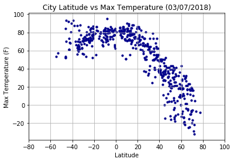
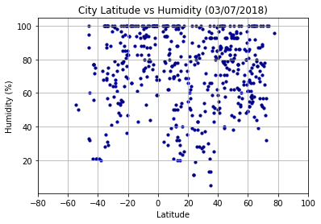
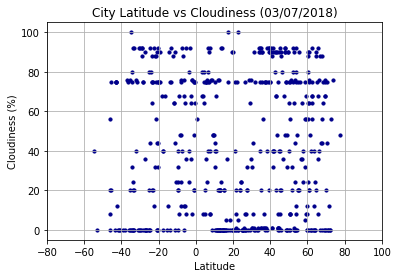
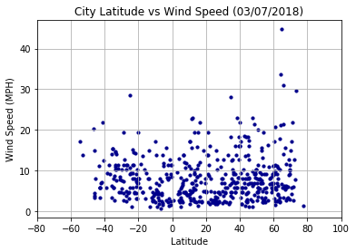

```python
# Your objective is to build a series of scatter plots to showcase the following relationships:

# * Temperature (F) vs. Latitude
# * Humidity (%) vs. Latitude
# * Cloudiness (%) vs. Latitude
# * Wind Speed (mph) vs. Latitude

# Your final notebook must:

# * Randomly select **at least** 500 unique (non-repeat) cities based on latitude and longitude.
# * Perform a weather check on each of the cities using a series of successive API calls. 
# * Include a print log of each city as it's being processed with the city number, city name, and requested URL.
# * Save both a CSV of all data retrieved and png images for each scatter plot.

# As final considerations:

# * You must use the Matplotlib and Seaborn libraries.
# * You must include a written description of three observable trends based on the data. 
# * You must use proper labeling of your plots, including aspects like: Plot Titles (with date of analysis) and Axes Labels.
# * You must include an exported markdown version of your Notebook called  `README.md` in your GitHub repository.  
# * See [Example Solution](WeatherPy_Example.pdf) for a reference on expected format. 
```

##  Data Analysis
-  As latitude is closer to '0' (the equator), temperatures recorded are at the highest point on the scatterplot (Temp vs Lat).
-  There is little to no correlation between latitude and each of the following factors: cloudiness, humidity, and wind speed.
-  The greater a location's latitude is away from the equator, the temperatures will drop significantly.


```python
# Dependencies
import matplotlib.pyplot as plt
import seaborn as sns
import pandas as pd
import numpy as np
import requests
import random
import decimal
import csv
from pprint import pprint
from config_owr import api_key

# Save config information
url = "http://api.openweathermap.org/data/2.5/weather?"
units = "imperial"

# Build a partial query URL
query_url = f"{url}units={units}&APPID={api_key}&q="

# Find a random sample of 550 latitude & longitude marks
latitudes = []
nlat = 0

while nlat < 1500:
    sample_lat = float(decimal.Decimal(random.randrange(-9000,9001))/100)
    latitudes.append(sample_lat)
    nlat +=1

longitudes = []
nlong = 0

while nlong <1500:
    sample_long = float(decimal.Decimal(random.randrange(-18000,18001))/100)
    longitudes.append(sample_long)
    nlong +=1

df = pd.DataFrame()
lat = pd.Series(latitudes)
long = pd.Series(longitudes)
df['latitude'] = lat.values
df['longitude'] = long.values
len(df['latitude'])
```


    1500


###  Generate Cities List


```python
from citipy import citipy
cities = []
countries = []

for i in range(0, 1500):
    lat = df.iloc[i]['latitude']
    lon = df.iloc[i]['longitude']
    city = citipy.nearest_city(lat, lon)
    cityname = city.city_name
    cities.append(cityname)
    countrycode = city.country_code
    countries.append(countrycode)

citylocation = pd.Series(cities)
countrylocation = pd.Series(countries)
df['city'] = citylocation.values
df['country'] = countrylocation.values
df.drop_duplicates(subset = ['city','country'], keep = 'first', inplace = True)
```


```python
# Re-index our dataframe
citydf = df.reset_index(drop=True)
citydf[['city','country','latitude','longitude']]
```


<div>
<style>
    .dataframe thead tr:only-child th {
        text-align: right;
    }

    .dataframe thead th {
        text-align: left;
    }

    .dataframe tbody tr th {
        vertical-align: top;
    }
</style>
<table border="1" class="dataframe">
  <thead>
    <tr style="text-align: right;">
      <th></th>
      <th>city</th>
      <th>country</th>
      <th>latitude</th>
      <th>longitude</th>
    </tr>
  </thead>
  <tbody>
    <tr>
      <th>0</th>
      <td>porbandar</td>
      <td>in</td>
      <td>17.13</td>
      <td>65.07</td>
    </tr>
    <tr>
      <th>1</th>
      <td>flinders</td>
      <td>au</td>
      <td>-31.34</td>
      <td>134.26</td>
    </tr>
    <tr>
      <th>2</th>
      <td>port moresby</td>
      <td>pg</td>
      <td>-11.14</td>
      <td>145.92</td>
    </tr>
    <tr>
      <th>3</th>
      <td>butaritari</td>
      <td>ki</td>
      <td>16.71</td>
      <td>170.59</td>
    </tr>
    <tr>
      <th>4</th>
      <td>nanortalik</td>
      <td>gl</td>
      <td>55.84</td>
      <td>-36.82</td>
    </tr>
    <tr>
      <th>5</th>
      <td>hermanus</td>
      <td>za</td>
      <td>-73.98</td>
      <td>4.82</td>
    </tr>
    <tr>
      <th>6</th>
      <td>saskylakh</td>
      <td>ru</td>
      <td>84.14</td>
      <td>120.79</td>
    </tr>
    <tr>
      <th>7</th>
      <td>nemuro</td>
      <td>jp</td>
      <td>42.25</td>
      <td>145.32</td>
    </tr>
    <tr>
      <th>8</th>
      <td>sokolo</td>
      <td>ml</td>
      <td>14.55</td>
      <td>-6.61</td>
    </tr>
    <tr>
      <th>9</th>
      <td>brae</td>
      <td>gb</td>
      <td>60.09</td>
      <td>-2.35</td>
    </tr>
    <tr>
      <th>10</th>
      <td>busselton</td>
      <td>au</td>
      <td>-41.71</td>
      <td>110.88</td>
    </tr>
    <tr>
      <th>11</th>
      <td>la peca</td>
      <td>pe</td>
      <td>-5.49</td>
      <td>-78.39</td>
    </tr>
    <tr>
      <th>12</th>
      <td>faanui</td>
      <td>pf</td>
      <td>-12.96</td>
      <td>-151.58</td>
    </tr>
    <tr>
      <th>13</th>
      <td>thompson</td>
      <td>ca</td>
      <td>69.56</td>
      <td>-94.71</td>
    </tr>
    <tr>
      <th>14</th>
      <td>bathsheba</td>
      <td>bb</td>
      <td>15.16</td>
      <td>-56.51</td>
    </tr>
    <tr>
      <th>15</th>
      <td>yulara</td>
      <td>au</td>
      <td>-25.91</td>
      <td>129.26</td>
    </tr>
    <tr>
      <th>16</th>
      <td>coquimbo</td>
      <td>cl</td>
      <td>-27.19</td>
      <td>-80.14</td>
    </tr>
    <tr>
      <th>17</th>
      <td>bluff</td>
      <td>nz</td>
      <td>-62.32</td>
      <td>163.16</td>
    </tr>
    <tr>
      <th>18</th>
      <td>taolanaro</td>
      <td>mg</td>
      <td>-74.75</td>
      <td>58.11</td>
    </tr>
    <tr>
      <th>19</th>
      <td>kapaa</td>
      <td>us</td>
      <td>18.31</td>
      <td>-171.26</td>
    </tr>
    <tr>
      <th>20</th>
      <td>rapid valley</td>
      <td>us</td>
      <td>43.67</td>
      <td>-102.65</td>
    </tr>
    <tr>
      <th>21</th>
      <td>sabla</td>
      <td>bg</td>
      <td>43.24</td>
      <td>28.70</td>
    </tr>
    <tr>
      <th>22</th>
      <td>rikitea</td>
      <td>pf</td>
      <td>-61.21</td>
      <td>-141.38</td>
    </tr>
    <tr>
      <th>23</th>
      <td>pensacola</td>
      <td>us</td>
      <td>30.29</td>
      <td>-86.93</td>
    </tr>
    <tr>
      <th>24</th>
      <td>dikson</td>
      <td>ru</td>
      <td>88.17</td>
      <td>70.06</td>
    </tr>
    <tr>
      <th>25</th>
      <td>ruatoria</td>
      <td>nz</td>
      <td>-36.63</td>
      <td>178.06</td>
    </tr>
    <tr>
      <th>26</th>
      <td>tuatapere</td>
      <td>nz</td>
      <td>-62.87</td>
      <td>155.37</td>
    </tr>
    <tr>
      <th>27</th>
      <td>georgetown</td>
      <td>sh</td>
      <td>-3.60</td>
      <td>-11.90</td>
    </tr>
    <tr>
      <th>28</th>
      <td>margate</td>
      <td>za</td>
      <td>-39.24</td>
      <td>41.43</td>
    </tr>
    <tr>
      <th>29</th>
      <td>awjilah</td>
      <td>ly</td>
      <td>29.31</td>
      <td>20.13</td>
    </tr>
    <tr>
      <th>...</th>
      <td>...</td>
      <td>...</td>
      <td>...</td>
      <td>...</td>
    </tr>
    <tr>
      <th>542</th>
      <td>chimbote</td>
      <td>pe</td>
      <td>-12.65</td>
      <td>-85.51</td>
    </tr>
    <tr>
      <th>543</th>
      <td>henties bay</td>
      <td>na</td>
      <td>-21.37</td>
      <td>8.39</td>
    </tr>
    <tr>
      <th>544</th>
      <td>talcahuano</td>
      <td>cl</td>
      <td>-33.12</td>
      <td>-78.87</td>
    </tr>
    <tr>
      <th>545</th>
      <td>kununurra</td>
      <td>au</td>
      <td>-17.52</td>
      <td>130.20</td>
    </tr>
    <tr>
      <th>546</th>
      <td>mwinilunga</td>
      <td>zm</td>
      <td>-10.99</td>
      <td>25.34</td>
    </tr>
    <tr>
      <th>547</th>
      <td>richards bay</td>
      <td>za</td>
      <td>-28.17</td>
      <td>33.07</td>
    </tr>
    <tr>
      <th>548</th>
      <td>minab</td>
      <td>ir</td>
      <td>25.97</td>
      <td>57.58</td>
    </tr>
    <tr>
      <th>549</th>
      <td>ahuimanu</td>
      <td>us</td>
      <td>35.91</td>
      <td>-151.97</td>
    </tr>
    <tr>
      <th>550</th>
      <td>otacilio costa</td>
      <td>br</td>
      <td>-27.69</td>
      <td>-49.94</td>
    </tr>
    <tr>
      <th>551</th>
      <td>syracuse</td>
      <td>it</td>
      <td>36.70</td>
      <td>16.09</td>
    </tr>
    <tr>
      <th>552</th>
      <td>matamoros</td>
      <td>mx</td>
      <td>24.99</td>
      <td>-96.66</td>
    </tr>
    <tr>
      <th>553</th>
      <td>diplo</td>
      <td>pk</td>
      <td>24.24</td>
      <td>69.76</td>
    </tr>
    <tr>
      <th>554</th>
      <td>qianan</td>
      <td>cn</td>
      <td>45.61</td>
      <td>124.22</td>
    </tr>
    <tr>
      <th>555</th>
      <td>la malbaie</td>
      <td>ca</td>
      <td>48.03</td>
      <td>-69.99</td>
    </tr>
    <tr>
      <th>556</th>
      <td>teguldet</td>
      <td>ru</td>
      <td>57.73</td>
      <td>88.94</td>
    </tr>
    <tr>
      <th>557</th>
      <td>naze</td>
      <td>jp</td>
      <td>25.25</td>
      <td>132.53</td>
    </tr>
    <tr>
      <th>558</th>
      <td>duartina</td>
      <td>br</td>
      <td>-22.38</td>
      <td>-49.42</td>
    </tr>
    <tr>
      <th>559</th>
      <td>tual</td>
      <td>id</td>
      <td>-8.67</td>
      <td>133.21</td>
    </tr>
    <tr>
      <th>560</th>
      <td>flagstaff</td>
      <td>us</td>
      <td>37.03</td>
      <td>-111.09</td>
    </tr>
    <tr>
      <th>561</th>
      <td>qaqortoq</td>
      <td>gl</td>
      <td>63.43</td>
      <td>-45.18</td>
    </tr>
    <tr>
      <th>562</th>
      <td>mackay</td>
      <td>au</td>
      <td>-17.70</td>
      <td>152.97</td>
    </tr>
    <tr>
      <th>563</th>
      <td>zatoka</td>
      <td>ua</td>
      <td>44.93</td>
      <td>31.10</td>
    </tr>
    <tr>
      <th>564</th>
      <td>epe</td>
      <td>ng</td>
      <td>5.21</td>
      <td>4.04</td>
    </tr>
    <tr>
      <th>565</th>
      <td>pauini</td>
      <td>br</td>
      <td>-7.93</td>
      <td>-67.11</td>
    </tr>
    <tr>
      <th>566</th>
      <td>tupik</td>
      <td>ru</td>
      <td>55.47</td>
      <td>119.33</td>
    </tr>
    <tr>
      <th>567</th>
      <td>gizo</td>
      <td>sb</td>
      <td>-13.33</td>
      <td>156.39</td>
    </tr>
    <tr>
      <th>568</th>
      <td>port macquarie</td>
      <td>au</td>
      <td>-31.32</td>
      <td>153.62</td>
    </tr>
    <tr>
      <th>569</th>
      <td>lubumbashi</td>
      <td>cd</td>
      <td>-11.64</td>
      <td>27.52</td>
    </tr>
    <tr>
      <th>570</th>
      <td>poum</td>
      <td>nc</td>
      <td>-23.87</td>
      <td>159.76</td>
    </tr>
    <tr>
      <th>571</th>
      <td>amapa</td>
      <td>br</td>
      <td>4.20</td>
      <td>-46.57</td>
    </tr>
  </tbody>
</table>
<p>572 rows × 4 columns</p>
</div>


###  Perform API Calls


```python
# Make calls to API, pull requests into lists
import datetime

# citydf["city_url"] = [row.replace(" ", "%20") for row in citydf["city"]]
cities = citydf['city'].tolist()

citynm = []
clouds = []
countries =[]
humidness = []
max_temps = []
latitudes = []
longitudes = []
wind_speeds = []
datetimes = []

print("Beginning Data Retrieval\n---------------------------")
for city in cities:
    try:
        print(f"Processing Record {cities.index(city)} | {city}")
        response = requests.get(f"{query_url}{city}").json()
        citynm.append(response["name"])
        clouds.append(response["clouds"]["all"])
        countries.append(response["sys"]["country"])
        humidness.append(response["main"]["humidity"])
        max_temps.append(response["main"]["temp_max"])
        latitudes.append(response["coord"]["lat"])
        longitudes.append(response["coord"]["lon"])
        wind_speeds.append(response["wind"]["speed"])
        dt = datetime.datetime.utcfromtimestamp(response["dt"])
        datetimes.append(dt)
        print(f"{query_url}{city}")
    except:
        print(f"Unexpected Error: {response['message']}")
print(f"------------------------------\nData Retrieval Complete\n------------------------------")
```

    Beginning Data Retrieval
    ---------------------------
    Processing Record 0 | porbandar
    http://api.openweathermap.org/data/2.5/weather?units=imperial&APPID=e28cecf75e64959a48dc8db912b2bdbb&q=porbandar
    Processing Record 1 | flinders
    http://api.openweathermap.org/data/2.5/weather?units=imperial&APPID=e28cecf75e64959a48dc8db912b2bdbb&q=flinders
    Processing Record 2 | port moresby
    http://api.openweathermap.org/data/2.5/weather?units=imperial&APPID=e28cecf75e64959a48dc8db912b2bdbb&q=port moresby
    Processing Record 3 | butaritari
    http://api.openweathermap.org/data/2.5/weather?units=imperial&APPID=e28cecf75e64959a48dc8db912b2bdbb&q=butaritari
    Processing Record 4 | nanortalik
    http://api.openweathermap.org/data/2.5/weather?units=imperial&APPID=e28cecf75e64959a48dc8db912b2bdbb&q=nanortalik
    Processing Record 5 | hermanus
    http://api.openweathermap.org/data/2.5/weather?units=imperial&APPID=e28cecf75e64959a48dc8db912b2bdbb&q=hermanus
    Processing Record 6 | saskylakh
    http://api.openweathermap.org/data/2.5/weather?units=imperial&APPID=e28cecf75e64959a48dc8db912b2bdbb&q=saskylakh
    Processing Record 7 | nemuro
    http://api.openweathermap.org/data/2.5/weather?units=imperial&APPID=e28cecf75e64959a48dc8db912b2bdbb&q=nemuro
    Processing Record 8 | sokolo
    http://api.openweathermap.org/data/2.5/weather?units=imperial&APPID=e28cecf75e64959a48dc8db912b2bdbb&q=sokolo
    Processing Record 9 | brae
    http://api.openweathermap.org/data/2.5/weather?units=imperial&APPID=e28cecf75e64959a48dc8db912b2bdbb&q=brae
    Processing Record 10 | busselton
    http://api.openweathermap.org/data/2.5/weather?units=imperial&APPID=e28cecf75e64959a48dc8db912b2bdbb&q=busselton
    Processing Record 11 | la peca
    http://api.openweathermap.org/data/2.5/weather?units=imperial&APPID=e28cecf75e64959a48dc8db912b2bdbb&q=la peca
    Processing Record 12 | faanui
    http://api.openweathermap.org/data/2.5/weather?units=imperial&APPID=e28cecf75e64959a48dc8db912b2bdbb&q=faanui
    Processing Record 13 | thompson
    http://api.openweathermap.org/data/2.5/weather?units=imperial&APPID=e28cecf75e64959a48dc8db912b2bdbb&q=thompson
    Processing Record 14 | bathsheba
    http://api.openweathermap.org/data/2.5/weather?units=imperial&APPID=e28cecf75e64959a48dc8db912b2bdbb&q=bathsheba
    Processing Record 15 | yulara
    http://api.openweathermap.org/data/2.5/weather?units=imperial&APPID=e28cecf75e64959a48dc8db912b2bdbb&q=yulara
    Processing Record 16 | coquimbo
    http://api.openweathermap.org/data/2.5/weather?units=imperial&APPID=e28cecf75e64959a48dc8db912b2bdbb&q=coquimbo
    Processing Record 17 | bluff
    http://api.openweathermap.org/data/2.5/weather?units=imperial&APPID=e28cecf75e64959a48dc8db912b2bdbb&q=bluff
    Processing Record 18 | taolanaro
    Unexpected Error: city not found
    Processing Record 19 | kapaa
    http://api.openweathermap.org/data/2.5/weather?units=imperial&APPID=e28cecf75e64959a48dc8db912b2bdbb&q=kapaa
    Processing Record 20 | rapid valley
    http://api.openweathermap.org/data/2.5/weather?units=imperial&APPID=e28cecf75e64959a48dc8db912b2bdbb&q=rapid valley
    Processing Record 21 | sabla
    http://api.openweathermap.org/data/2.5/weather?units=imperial&APPID=e28cecf75e64959a48dc8db912b2bdbb&q=sabla
    Processing Record 22 | rikitea
    http://api.openweathermap.org/data/2.5/weather?units=imperial&APPID=e28cecf75e64959a48dc8db912b2bdbb&q=rikitea
    Processing Record 23 | pensacola
    http://api.openweathermap.org/data/2.5/weather?units=imperial&APPID=e28cecf75e64959a48dc8db912b2bdbb&q=pensacola
    Processing Record 24 | dikson
    http://api.openweathermap.org/data/2.5/weather?units=imperial&APPID=e28cecf75e64959a48dc8db912b2bdbb&q=dikson
    Processing Record 25 | ruatoria
    Unexpected Error: city not found
    Processing Record 26 | tuatapere
    http://api.openweathermap.org/data/2.5/weather?units=imperial&APPID=e28cecf75e64959a48dc8db912b2bdbb&q=tuatapere
    Processing Record 27 | georgetown
    http://api.openweathermap.org/data/2.5/weather?units=imperial&APPID=e28cecf75e64959a48dc8db912b2bdbb&q=georgetown
    Processing Record 28 | margate
    http://api.openweathermap.org/data/2.5/weather?units=imperial&APPID=e28cecf75e64959a48dc8db912b2bdbb&q=margate
    Processing Record 29 | awjilah
    http://api.openweathermap.org/data/2.5/weather?units=imperial&APPID=e28cecf75e64959a48dc8db912b2bdbb&q=awjilah
    Processing Record 30 | hithadhoo
    http://api.openweathermap.org/data/2.5/weather?units=imperial&APPID=e28cecf75e64959a48dc8db912b2bdbb&q=hithadhoo
    Processing Record 31 | hilo
    http://api.openweathermap.org/data/2.5/weather?units=imperial&APPID=e28cecf75e64959a48dc8db912b2bdbb&q=hilo
    Processing Record 32 | luderitz
    http://api.openweathermap.org/data/2.5/weather?units=imperial&APPID=e28cecf75e64959a48dc8db912b2bdbb&q=luderitz
    Processing Record 33 | vaini
    http://api.openweathermap.org/data/2.5/weather?units=imperial&APPID=e28cecf75e64959a48dc8db912b2bdbb&q=vaini
    Processing Record 34 | tuktoyaktuk
    http://api.openweathermap.org/data/2.5/weather?units=imperial&APPID=e28cecf75e64959a48dc8db912b2bdbb&q=tuktoyaktuk
    Processing Record 35 | pandan
    http://api.openweathermap.org/data/2.5/weather?units=imperial&APPID=e28cecf75e64959a48dc8db912b2bdbb&q=pandan
    Processing Record 36 | conceicao do araguaia
    http://api.openweathermap.org/data/2.5/weather?units=imperial&APPID=e28cecf75e64959a48dc8db912b2bdbb&q=conceicao do araguaia
    Processing Record 37 | genoa
    http://api.openweathermap.org/data/2.5/weather?units=imperial&APPID=e28cecf75e64959a48dc8db912b2bdbb&q=genoa
    Processing Record 38 | hobart
    http://api.openweathermap.org/data/2.5/weather?units=imperial&APPID=e28cecf75e64959a48dc8db912b2bdbb&q=hobart
    Processing Record 39 | kahului
    http://api.openweathermap.org/data/2.5/weather?units=imperial&APPID=e28cecf75e64959a48dc8db912b2bdbb&q=kahului
    Processing Record 40 | bredasdorp
    http://api.openweathermap.org/data/2.5/weather?units=imperial&APPID=e28cecf75e64959a48dc8db912b2bdbb&q=bredasdorp
    Processing Record 41 | katha
    Unexpected Error: city not found
    Processing Record 42 | qaanaaq
    http://api.openweathermap.org/data/2.5/weather?units=imperial&APPID=e28cecf75e64959a48dc8db912b2bdbb&q=qaanaaq
    Processing Record 43 | chulman
    http://api.openweathermap.org/data/2.5/weather?units=imperial&APPID=e28cecf75e64959a48dc8db912b2bdbb&q=chulman
    Processing Record 44 | port alfred
    http://api.openweathermap.org/data/2.5/weather?units=imperial&APPID=e28cecf75e64959a48dc8db912b2bdbb&q=port alfred
    Processing Record 45 | galiwinku
    Unexpected Error: city not found
    Processing Record 46 | albany
    http://api.openweathermap.org/data/2.5/weather?units=imperial&APPID=e28cecf75e64959a48dc8db912b2bdbb&q=albany
    Processing Record 47 | kamaishi
    http://api.openweathermap.org/data/2.5/weather?units=imperial&APPID=e28cecf75e64959a48dc8db912b2bdbb&q=kamaishi
    Processing Record 48 | san cristobal
    http://api.openweathermap.org/data/2.5/weather?units=imperial&APPID=e28cecf75e64959a48dc8db912b2bdbb&q=san cristobal
    Processing Record 49 | saint-philippe
    http://api.openweathermap.org/data/2.5/weather?units=imperial&APPID=e28cecf75e64959a48dc8db912b2bdbb&q=saint-philippe
    Processing Record 50 | barrow
    http://api.openweathermap.org/data/2.5/weather?units=imperial&APPID=e28cecf75e64959a48dc8db912b2bdbb&q=barrow
    Processing Record 51 | toliary
    Unexpected Error: city not found
    Processing Record 52 | punta arenas
    http://api.openweathermap.org/data/2.5/weather?units=imperial&APPID=e28cecf75e64959a48dc8db912b2bdbb&q=punta arenas
    Processing Record 53 | alice springs
    http://api.openweathermap.org/data/2.5/weather?units=imperial&APPID=e28cecf75e64959a48dc8db912b2bdbb&q=alice springs
    Processing Record 54 | touros
    http://api.openweathermap.org/data/2.5/weather?units=imperial&APPID=e28cecf75e64959a48dc8db912b2bdbb&q=touros
    Processing Record 55 | alofi
    http://api.openweathermap.org/data/2.5/weather?units=imperial&APPID=e28cecf75e64959a48dc8db912b2bdbb&q=alofi
    Processing Record 56 | mahebourg
    http://api.openweathermap.org/data/2.5/weather?units=imperial&APPID=e28cecf75e64959a48dc8db912b2bdbb&q=mahebourg
    Processing Record 57 | katsuura
    http://api.openweathermap.org/data/2.5/weather?units=imperial&APPID=e28cecf75e64959a48dc8db912b2bdbb&q=katsuura
    Processing Record 58 | batemans bay
    http://api.openweathermap.org/data/2.5/weather?units=imperial&APPID=e28cecf75e64959a48dc8db912b2bdbb&q=batemans bay
    Processing Record 59 | ushuaia
    http://api.openweathermap.org/data/2.5/weather?units=imperial&APPID=e28cecf75e64959a48dc8db912b2bdbb&q=ushuaia
    Processing Record 60 | nguiu
    Unexpected Error: city not found
    Processing Record 61 | esperance
    http://api.openweathermap.org/data/2.5/weather?units=imperial&APPID=e28cecf75e64959a48dc8db912b2bdbb&q=esperance
    Processing Record 62 | tarakan
    http://api.openweathermap.org/data/2.5/weather?units=imperial&APPID=e28cecf75e64959a48dc8db912b2bdbb&q=tarakan
    Processing Record 63 | vostok
    http://api.openweathermap.org/data/2.5/weather?units=imperial&APPID=e28cecf75e64959a48dc8db912b2bdbb&q=vostok
    Processing Record 64 | kaitangata
    http://api.openweathermap.org/data/2.5/weather?units=imperial&APPID=e28cecf75e64959a48dc8db912b2bdbb&q=kaitangata
    Processing Record 65 | san rafael del sur
    http://api.openweathermap.org/data/2.5/weather?units=imperial&APPID=e28cecf75e64959a48dc8db912b2bdbb&q=san rafael del sur
    Processing Record 66 | maraa
    http://api.openweathermap.org/data/2.5/weather?units=imperial&APPID=e28cecf75e64959a48dc8db912b2bdbb&q=maraa
    Processing Record 67 | miedzyrzec podlaski
    http://api.openweathermap.org/data/2.5/weather?units=imperial&APPID=e28cecf75e64959a48dc8db912b2bdbb&q=miedzyrzec podlaski
    Processing Record 68 | khatanga
    http://api.openweathermap.org/data/2.5/weather?units=imperial&APPID=e28cecf75e64959a48dc8db912b2bdbb&q=khatanga
    Processing Record 69 | riyadh
    http://api.openweathermap.org/data/2.5/weather?units=imperial&APPID=e28cecf75e64959a48dc8db912b2bdbb&q=riyadh
    Processing Record 70 | east london
    http://api.openweathermap.org/data/2.5/weather?units=imperial&APPID=e28cecf75e64959a48dc8db912b2bdbb&q=east london
    Processing Record 71 | mookane
    http://api.openweathermap.org/data/2.5/weather?units=imperial&APPID=e28cecf75e64959a48dc8db912b2bdbb&q=mookane
    Processing Record 72 | narsaq
    http://api.openweathermap.org/data/2.5/weather?units=imperial&APPID=e28cecf75e64959a48dc8db912b2bdbb&q=narsaq
    Processing Record 73 | avera
    http://api.openweathermap.org/data/2.5/weather?units=imperial&APPID=e28cecf75e64959a48dc8db912b2bdbb&q=avera
    Processing Record 74 | airai
    http://api.openweathermap.org/data/2.5/weather?units=imperial&APPID=e28cecf75e64959a48dc8db912b2bdbb&q=airai
    Processing Record 75 | attawapiskat
    Unexpected Error: city not found
    Processing Record 76 | jamestown
    http://api.openweathermap.org/data/2.5/weather?units=imperial&APPID=e28cecf75e64959a48dc8db912b2bdbb&q=jamestown
    Processing Record 77 | palabuhanratu
    Unexpected Error: city not found
    Processing Record 78 | aden
    http://api.openweathermap.org/data/2.5/weather?units=imperial&APPID=e28cecf75e64959a48dc8db912b2bdbb&q=aden
    Processing Record 79 | pangnirtung
    http://api.openweathermap.org/data/2.5/weather?units=imperial&APPID=e28cecf75e64959a48dc8db912b2bdbb&q=pangnirtung
    Processing Record 80 | warqla
    Unexpected Error: city not found
    Processing Record 81 | rockhampton
    http://api.openweathermap.org/data/2.5/weather?units=imperial&APPID=e28cecf75e64959a48dc8db912b2bdbb&q=rockhampton
    Processing Record 82 | mar del plata
    http://api.openweathermap.org/data/2.5/weather?units=imperial&APPID=e28cecf75e64959a48dc8db912b2bdbb&q=mar del plata
    Processing Record 83 | kavieng
    http://api.openweathermap.org/data/2.5/weather?units=imperial&APPID=e28cecf75e64959a48dc8db912b2bdbb&q=kavieng
    Processing Record 84 | bambous virieux
    http://api.openweathermap.org/data/2.5/weather?units=imperial&APPID=e28cecf75e64959a48dc8db912b2bdbb&q=bambous virieux
    Processing Record 85 | grand centre
    Unexpected Error: city not found
    Processing Record 86 | srednekolymsk
    http://api.openweathermap.org/data/2.5/weather?units=imperial&APPID=e28cecf75e64959a48dc8db912b2bdbb&q=srednekolymsk
    Processing Record 87 | ponta do sol
    http://api.openweathermap.org/data/2.5/weather?units=imperial&APPID=e28cecf75e64959a48dc8db912b2bdbb&q=ponta do sol
    Processing Record 88 | mount isa
    http://api.openweathermap.org/data/2.5/weather?units=imperial&APPID=e28cecf75e64959a48dc8db912b2bdbb&q=mount isa
    Processing Record 89 | iqaluit
    http://api.openweathermap.org/data/2.5/weather?units=imperial&APPID=e28cecf75e64959a48dc8db912b2bdbb&q=iqaluit
    Processing Record 90 | cape town
    http://api.openweathermap.org/data/2.5/weather?units=imperial&APPID=e28cecf75e64959a48dc8db912b2bdbb&q=cape town
    Processing Record 91 | port elizabeth
    http://api.openweathermap.org/data/2.5/weather?units=imperial&APPID=e28cecf75e64959a48dc8db912b2bdbb&q=port elizabeth
    Processing Record 92 | moba
    http://api.openweathermap.org/data/2.5/weather?units=imperial&APPID=e28cecf75e64959a48dc8db912b2bdbb&q=moba
    Processing Record 93 | nichinan
    http://api.openweathermap.org/data/2.5/weather?units=imperial&APPID=e28cecf75e64959a48dc8db912b2bdbb&q=nichinan
    Processing Record 94 | lata
    http://api.openweathermap.org/data/2.5/weather?units=imperial&APPID=e28cecf75e64959a48dc8db912b2bdbb&q=lata
    Processing Record 95 | verkhnevilyuysk
    http://api.openweathermap.org/data/2.5/weather?units=imperial&APPID=e28cecf75e64959a48dc8db912b2bdbb&q=verkhnevilyuysk
    Processing Record 96 | cumaribo
    Unexpected Error: city not found
    Processing Record 97 | mataura
    http://api.openweathermap.org/data/2.5/weather?units=imperial&APPID=e28cecf75e64959a48dc8db912b2bdbb&q=mataura
    Processing Record 98 | bela
    http://api.openweathermap.org/data/2.5/weather?units=imperial&APPID=e28cecf75e64959a48dc8db912b2bdbb&q=bela
    Processing Record 99 | yellowknife
    http://api.openweathermap.org/data/2.5/weather?units=imperial&APPID=e28cecf75e64959a48dc8db912b2bdbb&q=yellowknife
    Processing Record 100 | champerico
    http://api.openweathermap.org/data/2.5/weather?units=imperial&APPID=e28cecf75e64959a48dc8db912b2bdbb&q=champerico
    Processing Record 101 | tilichiki
    http://api.openweathermap.org/data/2.5/weather?units=imperial&APPID=e28cecf75e64959a48dc8db912b2bdbb&q=tilichiki
    Processing Record 102 | sur
    http://api.openweathermap.org/data/2.5/weather?units=imperial&APPID=e28cecf75e64959a48dc8db912b2bdbb&q=sur
    Processing Record 103 | torbay
    http://api.openweathermap.org/data/2.5/weather?units=imperial&APPID=e28cecf75e64959a48dc8db912b2bdbb&q=torbay
    Processing Record 104 | kodiak
    http://api.openweathermap.org/data/2.5/weather?units=imperial&APPID=e28cecf75e64959a48dc8db912b2bdbb&q=kodiak
    Processing Record 105 | kamenskoye
    Unexpected Error: city not found
    Processing Record 106 | oswego
    http://api.openweathermap.org/data/2.5/weather?units=imperial&APPID=e28cecf75e64959a48dc8db912b2bdbb&q=oswego
    Processing Record 107 | belushya guba
    Unexpected Error: city not found
    Processing Record 108 | bambanglipuro
    http://api.openweathermap.org/data/2.5/weather?units=imperial&APPID=e28cecf75e64959a48dc8db912b2bdbb&q=bambanglipuro
    Processing Record 109 | bilibino
    http://api.openweathermap.org/data/2.5/weather?units=imperial&APPID=e28cecf75e64959a48dc8db912b2bdbb&q=bilibino
    Processing Record 110 | west wendover
    http://api.openweathermap.org/data/2.5/weather?units=imperial&APPID=e28cecf75e64959a48dc8db912b2bdbb&q=west wendover
    Processing Record 111 | saint-junien
    http://api.openweathermap.org/data/2.5/weather?units=imperial&APPID=e28cecf75e64959a48dc8db912b2bdbb&q=saint-junien
    Processing Record 112 | taungdwingyi
    http://api.openweathermap.org/data/2.5/weather?units=imperial&APPID=e28cecf75e64959a48dc8db912b2bdbb&q=taungdwingyi
    Processing Record 113 | honningsvag
    http://api.openweathermap.org/data/2.5/weather?units=imperial&APPID=e28cecf75e64959a48dc8db912b2bdbb&q=honningsvag
    Processing Record 114 | pipri
    http://api.openweathermap.org/data/2.5/weather?units=imperial&APPID=e28cecf75e64959a48dc8db912b2bdbb&q=pipri
    Processing Record 115 | atuona
    http://api.openweathermap.org/data/2.5/weather?units=imperial&APPID=e28cecf75e64959a48dc8db912b2bdbb&q=atuona
    Processing Record 116 | puerto ayora
    http://api.openweathermap.org/data/2.5/weather?units=imperial&APPID=e28cecf75e64959a48dc8db912b2bdbb&q=puerto ayora
    Processing Record 117 | tasiilaq
    http://api.openweathermap.org/data/2.5/weather?units=imperial&APPID=e28cecf75e64959a48dc8db912b2bdbb&q=tasiilaq
    Processing Record 118 | flin flon
    http://api.openweathermap.org/data/2.5/weather?units=imperial&APPID=e28cecf75e64959a48dc8db912b2bdbb&q=flin flon
    Processing Record 119 | ketchikan
    http://api.openweathermap.org/data/2.5/weather?units=imperial&APPID=e28cecf75e64959a48dc8db912b2bdbb&q=ketchikan
    Processing Record 120 | villa del rosario
    http://api.openweathermap.org/data/2.5/weather?units=imperial&APPID=e28cecf75e64959a48dc8db912b2bdbb&q=villa del rosario
    Processing Record 121 | waingapu
    http://api.openweathermap.org/data/2.5/weather?units=imperial&APPID=e28cecf75e64959a48dc8db912b2bdbb&q=waingapu
    Processing Record 122 | new norfolk
    http://api.openweathermap.org/data/2.5/weather?units=imperial&APPID=e28cecf75e64959a48dc8db912b2bdbb&q=new norfolk
    Processing Record 123 | ciudad guayana
    http://api.openweathermap.org/data/2.5/weather?units=imperial&APPID=e28cecf75e64959a48dc8db912b2bdbb&q=ciudad guayana
    Processing Record 124 | provideniya
    http://api.openweathermap.org/data/2.5/weather?units=imperial&APPID=e28cecf75e64959a48dc8db912b2bdbb&q=provideniya
    Processing Record 125 | atocha
    http://api.openweathermap.org/data/2.5/weather?units=imperial&APPID=e28cecf75e64959a48dc8db912b2bdbb&q=atocha
    Processing Record 126 | wajid
    http://api.openweathermap.org/data/2.5/weather?units=imperial&APPID=e28cecf75e64959a48dc8db912b2bdbb&q=wajid
    Processing Record 127 | khuzhir
    http://api.openweathermap.org/data/2.5/weather?units=imperial&APPID=e28cecf75e64959a48dc8db912b2bdbb&q=khuzhir
    Processing Record 128 | iset
    http://api.openweathermap.org/data/2.5/weather?units=imperial&APPID=e28cecf75e64959a48dc8db912b2bdbb&q=iset
    Processing Record 129 | areosa
    http://api.openweathermap.org/data/2.5/weather?units=imperial&APPID=e28cecf75e64959a48dc8db912b2bdbb&q=areosa
    Processing Record 130 | chokurdakh
    http://api.openweathermap.org/data/2.5/weather?units=imperial&APPID=e28cecf75e64959a48dc8db912b2bdbb&q=chokurdakh
    Processing Record 131 | labuan
    http://api.openweathermap.org/data/2.5/weather?units=imperial&APPID=e28cecf75e64959a48dc8db912b2bdbb&q=labuan
    Processing Record 132 | barentsburg
    Unexpected Error: city not found
    Processing Record 133 | tupiza
    http://api.openweathermap.org/data/2.5/weather?units=imperial&APPID=e28cecf75e64959a48dc8db912b2bdbb&q=tupiza
    Processing Record 134 | garowe
    http://api.openweathermap.org/data/2.5/weather?units=imperial&APPID=e28cecf75e64959a48dc8db912b2bdbb&q=garowe
    Processing Record 135 | brandon
    http://api.openweathermap.org/data/2.5/weather?units=imperial&APPID=e28cecf75e64959a48dc8db912b2bdbb&q=brandon
    Processing Record 136 | nizhneyansk
    Unexpected Error: city not found
    Processing Record 137 | sakakah
    Unexpected Error: city not found
    Processing Record 138 | bonthe
    http://api.openweathermap.org/data/2.5/weather?units=imperial&APPID=e28cecf75e64959a48dc8db912b2bdbb&q=bonthe
    Processing Record 139 | ust-maya
    http://api.openweathermap.org/data/2.5/weather?units=imperial&APPID=e28cecf75e64959a48dc8db912b2bdbb&q=ust-maya
    Processing Record 140 | palizada
    http://api.openweathermap.org/data/2.5/weather?units=imperial&APPID=e28cecf75e64959a48dc8db912b2bdbb&q=palizada
    Processing Record 141 | codrington
    http://api.openweathermap.org/data/2.5/weather?units=imperial&APPID=e28cecf75e64959a48dc8db912b2bdbb&q=codrington
    Processing Record 142 | arraial do cabo
    http://api.openweathermap.org/data/2.5/weather?units=imperial&APPID=e28cecf75e64959a48dc8db912b2bdbb&q=arraial do cabo
    Processing Record 143 | ofunato
    http://api.openweathermap.org/data/2.5/weather?units=imperial&APPID=e28cecf75e64959a48dc8db912b2bdbb&q=ofunato
    Processing Record 144 | hofn
    http://api.openweathermap.org/data/2.5/weather?units=imperial&APPID=e28cecf75e64959a48dc8db912b2bdbb&q=hofn
    Processing Record 145 | pisco
    http://api.openweathermap.org/data/2.5/weather?units=imperial&APPID=e28cecf75e64959a48dc8db912b2bdbb&q=pisco
    Processing Record 146 | vestmannaeyjar
    http://api.openweathermap.org/data/2.5/weather?units=imperial&APPID=e28cecf75e64959a48dc8db912b2bdbb&q=vestmannaeyjar
    Processing Record 147 | khandyga
    http://api.openweathermap.org/data/2.5/weather?units=imperial&APPID=e28cecf75e64959a48dc8db912b2bdbb&q=khandyga
    Processing Record 148 | maceio
    http://api.openweathermap.org/data/2.5/weather?units=imperial&APPID=e28cecf75e64959a48dc8db912b2bdbb&q=maceio
    Processing Record 149 | asau
    Unexpected Error: city not found
    Processing Record 150 | honiara
    http://api.openweathermap.org/data/2.5/weather?units=imperial&APPID=e28cecf75e64959a48dc8db912b2bdbb&q=honiara
    Processing Record 151 | santa ines
    http://api.openweathermap.org/data/2.5/weather?units=imperial&APPID=e28cecf75e64959a48dc8db912b2bdbb&q=santa ines
    Processing Record 152 | poopo
    http://api.openweathermap.org/data/2.5/weather?units=imperial&APPID=e28cecf75e64959a48dc8db912b2bdbb&q=poopo
    Processing Record 153 | comodoro rivadavia
    http://api.openweathermap.org/data/2.5/weather?units=imperial&APPID=e28cecf75e64959a48dc8db912b2bdbb&q=comodoro rivadavia
    Processing Record 154 | banda aceh
    http://api.openweathermap.org/data/2.5/weather?units=imperial&APPID=e28cecf75e64959a48dc8db912b2bdbb&q=banda aceh
    Processing Record 155 | sitka
    http://api.openweathermap.org/data/2.5/weather?units=imperial&APPID=e28cecf75e64959a48dc8db912b2bdbb&q=sitka
    Processing Record 156 | great yarmouth
    http://api.openweathermap.org/data/2.5/weather?units=imperial&APPID=e28cecf75e64959a48dc8db912b2bdbb&q=great yarmouth
    Processing Record 157 | kulhudhuffushi
    http://api.openweathermap.org/data/2.5/weather?units=imperial&APPID=e28cecf75e64959a48dc8db912b2bdbb&q=kulhudhuffushi
    Processing Record 158 | upernavik
    http://api.openweathermap.org/data/2.5/weather?units=imperial&APPID=e28cecf75e64959a48dc8db912b2bdbb&q=upernavik
    Processing Record 159 | thunder bay
    http://api.openweathermap.org/data/2.5/weather?units=imperial&APPID=e28cecf75e64959a48dc8db912b2bdbb&q=thunder bay
    Processing Record 160 | umzimvubu
    Unexpected Error: city not found
    Processing Record 161 | illoqqortoormiut
    Unexpected Error: city not found
    Processing Record 162 | tubruq
    Unexpected Error: city not found
    Processing Record 163 | talnakh
    http://api.openweathermap.org/data/2.5/weather?units=imperial&APPID=e28cecf75e64959a48dc8db912b2bdbb&q=talnakh
    Processing Record 164 | tsentralnyy
    Unexpected Error: city not found
    Processing Record 165 | vila franca do campo
    http://api.openweathermap.org/data/2.5/weather?units=imperial&APPID=e28cecf75e64959a48dc8db912b2bdbb&q=vila franca do campo
    Processing Record 166 | ishikari
    Unexpected Error: city not found
    Processing Record 167 | newport
    http://api.openweathermap.org/data/2.5/weather?units=imperial&APPID=e28cecf75e64959a48dc8db912b2bdbb&q=newport
    Processing Record 168 | sentyabrskiy
    Unexpected Error: city not found
    Processing Record 169 | mazyr
    http://api.openweathermap.org/data/2.5/weather?units=imperial&APPID=e28cecf75e64959a48dc8db912b2bdbb&q=mazyr
    Processing Record 170 | carnarvon
    http://api.openweathermap.org/data/2.5/weather?units=imperial&APPID=e28cecf75e64959a48dc8db912b2bdbb&q=carnarvon
    Processing Record 171 | quesnel
    http://api.openweathermap.org/data/2.5/weather?units=imperial&APPID=e28cecf75e64959a48dc8db912b2bdbb&q=quesnel
    Processing Record 172 | avarua
    http://api.openweathermap.org/data/2.5/weather?units=imperial&APPID=e28cecf75e64959a48dc8db912b2bdbb&q=avarua
    Processing Record 173 | tumannyy
    Unexpected Error: city not found
    Processing Record 174 | okhotsk
    http://api.openweathermap.org/data/2.5/weather?units=imperial&APPID=e28cecf75e64959a48dc8db912b2bdbb&q=okhotsk
    Processing Record 175 | samarai
    http://api.openweathermap.org/data/2.5/weather?units=imperial&APPID=e28cecf75e64959a48dc8db912b2bdbb&q=samarai
    Processing Record 176 | vimperk
    http://api.openweathermap.org/data/2.5/weather?units=imperial&APPID=e28cecf75e64959a48dc8db912b2bdbb&q=vimperk
    Processing Record 177 | paita
    http://api.openweathermap.org/data/2.5/weather?units=imperial&APPID=e28cecf75e64959a48dc8db912b2bdbb&q=paita
    Processing Record 178 | udalguri
    http://api.openweathermap.org/data/2.5/weather?units=imperial&APPID=e28cecf75e64959a48dc8db912b2bdbb&q=udalguri
    Processing Record 179 | turukhansk
    http://api.openweathermap.org/data/2.5/weather?units=imperial&APPID=e28cecf75e64959a48dc8db912b2bdbb&q=turukhansk
    Processing Record 180 | mys shmidta
    Unexpected Error: city not found
    Processing Record 181 | saint george
    http://api.openweathermap.org/data/2.5/weather?units=imperial&APPID=e28cecf75e64959a48dc8db912b2bdbb&q=saint george
    Processing Record 182 | tawau
    http://api.openweathermap.org/data/2.5/weather?units=imperial&APPID=e28cecf75e64959a48dc8db912b2bdbb&q=tawau
    Processing Record 183 | leningradskiy
    http://api.openweathermap.org/data/2.5/weather?units=imperial&APPID=e28cecf75e64959a48dc8db912b2bdbb&q=leningradskiy
    Processing Record 184 | cabo san lucas
    http://api.openweathermap.org/data/2.5/weather?units=imperial&APPID=e28cecf75e64959a48dc8db912b2bdbb&q=cabo san lucas
    Processing Record 185 | nikolskoye
    http://api.openweathermap.org/data/2.5/weather?units=imperial&APPID=e28cecf75e64959a48dc8db912b2bdbb&q=nikolskoye
    Processing Record 186 | thayetmyo
    http://api.openweathermap.org/data/2.5/weather?units=imperial&APPID=e28cecf75e64959a48dc8db912b2bdbb&q=thayetmyo
    Processing Record 187 | cidreira
    http://api.openweathermap.org/data/2.5/weather?units=imperial&APPID=e28cecf75e64959a48dc8db912b2bdbb&q=cidreira
    Processing Record 188 | lavrentiya
    http://api.openweathermap.org/data/2.5/weather?units=imperial&APPID=e28cecf75e64959a48dc8db912b2bdbb&q=lavrentiya
    Processing Record 189 | dehloran
    http://api.openweathermap.org/data/2.5/weather?units=imperial&APPID=e28cecf75e64959a48dc8db912b2bdbb&q=dehloran
    Processing Record 190 | omsukchan
    http://api.openweathermap.org/data/2.5/weather?units=imperial&APPID=e28cecf75e64959a48dc8db912b2bdbb&q=omsukchan
    Processing Record 191 | presidente medici
    http://api.openweathermap.org/data/2.5/weather?units=imperial&APPID=e28cecf75e64959a48dc8db912b2bdbb&q=presidente medici
    Processing Record 192 | waddan
    http://api.openweathermap.org/data/2.5/weather?units=imperial&APPID=e28cecf75e64959a48dc8db912b2bdbb&q=waddan
    Processing Record 193 | louisbourg
    Unexpected Error: city not found
    Processing Record 194 | de aar
    http://api.openweathermap.org/data/2.5/weather?units=imperial&APPID=e28cecf75e64959a48dc8db912b2bdbb&q=de aar
    Processing Record 195 | ahvaz
    http://api.openweathermap.org/data/2.5/weather?units=imperial&APPID=e28cecf75e64959a48dc8db912b2bdbb&q=ahvaz
    Processing Record 196 | skjervoy
    http://api.openweathermap.org/data/2.5/weather?units=imperial&APPID=e28cecf75e64959a48dc8db912b2bdbb&q=skjervoy
    Processing Record 197 | san carlos de bariloche
    http://api.openweathermap.org/data/2.5/weather?units=imperial&APPID=e28cecf75e64959a48dc8db912b2bdbb&q=san carlos de bariloche
    Processing Record 198 | port shepstone
    http://api.openweathermap.org/data/2.5/weather?units=imperial&APPID=e28cecf75e64959a48dc8db912b2bdbb&q=port shepstone
    Processing Record 199 | clyde river
    http://api.openweathermap.org/data/2.5/weather?units=imperial&APPID=e28cecf75e64959a48dc8db912b2bdbb&q=clyde river
    Processing Record 200 | eskil
    http://api.openweathermap.org/data/2.5/weather?units=imperial&APPID=e28cecf75e64959a48dc8db912b2bdbb&q=eskil
    Processing Record 201 | whitehorse
    http://api.openweathermap.org/data/2.5/weather?units=imperial&APPID=e28cecf75e64959a48dc8db912b2bdbb&q=whitehorse
    Processing Record 202 | waiuku
    http://api.openweathermap.org/data/2.5/weather?units=imperial&APPID=e28cecf75e64959a48dc8db912b2bdbb&q=waiuku
    Processing Record 203 | ilulissat
    http://api.openweathermap.org/data/2.5/weather?units=imperial&APPID=e28cecf75e64959a48dc8db912b2bdbb&q=ilulissat
    Processing Record 204 | lanquin
    http://api.openweathermap.org/data/2.5/weather?units=imperial&APPID=e28cecf75e64959a48dc8db912b2bdbb&q=lanquin
    Processing Record 205 | gornopravdinsk
    http://api.openweathermap.org/data/2.5/weather?units=imperial&APPID=e28cecf75e64959a48dc8db912b2bdbb&q=gornopravdinsk
    Processing Record 206 | gat
    http://api.openweathermap.org/data/2.5/weather?units=imperial&APPID=e28cecf75e64959a48dc8db912b2bdbb&q=gat
    Processing Record 207 | faya
    http://api.openweathermap.org/data/2.5/weather?units=imperial&APPID=e28cecf75e64959a48dc8db912b2bdbb&q=faya
    Processing Record 208 | coihaique
    http://api.openweathermap.org/data/2.5/weather?units=imperial&APPID=e28cecf75e64959a48dc8db912b2bdbb&q=coihaique
    Processing Record 209 | ewa beach
    http://api.openweathermap.org/data/2.5/weather?units=imperial&APPID=e28cecf75e64959a48dc8db912b2bdbb&q=ewa beach
    Processing Record 210 | kismayo
    Unexpected Error: city not found
    Processing Record 211 | pitimbu
    http://api.openweathermap.org/data/2.5/weather?units=imperial&APPID=e28cecf75e64959a48dc8db912b2bdbb&q=pitimbu
    Processing Record 212 | crab hill
    Unexpected Error: city not found
    Processing Record 213 | taltal
    http://api.openweathermap.org/data/2.5/weather?units=imperial&APPID=e28cecf75e64959a48dc8db912b2bdbb&q=taltal
    Processing Record 214 | yerbogachen
    http://api.openweathermap.org/data/2.5/weather?units=imperial&APPID=e28cecf75e64959a48dc8db912b2bdbb&q=yerbogachen
    Processing Record 215 | lorengau
    http://api.openweathermap.org/data/2.5/weather?units=imperial&APPID=e28cecf75e64959a48dc8db912b2bdbb&q=lorengau
    Processing Record 216 | cherskiy
    http://api.openweathermap.org/data/2.5/weather?units=imperial&APPID=e28cecf75e64959a48dc8db912b2bdbb&q=cherskiy
    Processing Record 217 | ahipara
    http://api.openweathermap.org/data/2.5/weather?units=imperial&APPID=e28cecf75e64959a48dc8db912b2bdbb&q=ahipara
    Processing Record 218 | svetlogorsk
    http://api.openweathermap.org/data/2.5/weather?units=imperial&APPID=e28cecf75e64959a48dc8db912b2bdbb&q=svetlogorsk
    Processing Record 219 | aklavik
    http://api.openweathermap.org/data/2.5/weather?units=imperial&APPID=e28cecf75e64959a48dc8db912b2bdbb&q=aklavik
    Processing Record 220 | demba
    http://api.openweathermap.org/data/2.5/weather?units=imperial&APPID=e28cecf75e64959a48dc8db912b2bdbb&q=demba
    Processing Record 221 | khvoynaya
    http://api.openweathermap.org/data/2.5/weather?units=imperial&APPID=e28cecf75e64959a48dc8db912b2bdbb&q=khvoynaya
    Processing Record 222 | meyungs
    Unexpected Error: city not found
    Processing Record 223 | geraldton
    http://api.openweathermap.org/data/2.5/weather?units=imperial&APPID=e28cecf75e64959a48dc8db912b2bdbb&q=geraldton
    Processing Record 224 | dire
    http://api.openweathermap.org/data/2.5/weather?units=imperial&APPID=e28cecf75e64959a48dc8db912b2bdbb&q=dire
    Processing Record 225 | morristown
    http://api.openweathermap.org/data/2.5/weather?units=imperial&APPID=e28cecf75e64959a48dc8db912b2bdbb&q=morristown
    Processing Record 226 | chuy
    http://api.openweathermap.org/data/2.5/weather?units=imperial&APPID=e28cecf75e64959a48dc8db912b2bdbb&q=chuy
    Processing Record 227 | pokhara
    http://api.openweathermap.org/data/2.5/weather?units=imperial&APPID=e28cecf75e64959a48dc8db912b2bdbb&q=pokhara
    Processing Record 228 | pacific grove
    http://api.openweathermap.org/data/2.5/weather?units=imperial&APPID=e28cecf75e64959a48dc8db912b2bdbb&q=pacific grove
    Processing Record 229 | severo-kurilsk
    http://api.openweathermap.org/data/2.5/weather?units=imperial&APPID=e28cecf75e64959a48dc8db912b2bdbb&q=severo-kurilsk
    Processing Record 230 | san andres
    http://api.openweathermap.org/data/2.5/weather?units=imperial&APPID=e28cecf75e64959a48dc8db912b2bdbb&q=san andres
    Processing Record 231 | namatanai
    http://api.openweathermap.org/data/2.5/weather?units=imperial&APPID=e28cecf75e64959a48dc8db912b2bdbb&q=namatanai
    Processing Record 232 | saint-pierre
    http://api.openweathermap.org/data/2.5/weather?units=imperial&APPID=e28cecf75e64959a48dc8db912b2bdbb&q=saint-pierre
    Processing Record 233 | griffith
    http://api.openweathermap.org/data/2.5/weather?units=imperial&APPID=e28cecf75e64959a48dc8db912b2bdbb&q=griffith
    Processing Record 234 | samusu
    Unexpected Error: city not found
    Processing Record 235 | nandu
    http://api.openweathermap.org/data/2.5/weather?units=imperial&APPID=e28cecf75e64959a48dc8db912b2bdbb&q=nandu
    Processing Record 236 | dumalinao
    http://api.openweathermap.org/data/2.5/weather?units=imperial&APPID=e28cecf75e64959a48dc8db912b2bdbb&q=dumalinao
    Processing Record 237 | bethel
    http://api.openweathermap.org/data/2.5/weather?units=imperial&APPID=e28cecf75e64959a48dc8db912b2bdbb&q=bethel
    Processing Record 238 | fuerte olimpo
    http://api.openweathermap.org/data/2.5/weather?units=imperial&APPID=e28cecf75e64959a48dc8db912b2bdbb&q=fuerte olimpo
    Processing Record 239 | najran
    http://api.openweathermap.org/data/2.5/weather?units=imperial&APPID=e28cecf75e64959a48dc8db912b2bdbb&q=najran
    Processing Record 240 | ajdabiya
    http://api.openweathermap.org/data/2.5/weather?units=imperial&APPID=e28cecf75e64959a48dc8db912b2bdbb&q=ajdabiya
    Processing Record 241 | trincomalee
    http://api.openweathermap.org/data/2.5/weather?units=imperial&APPID=e28cecf75e64959a48dc8db912b2bdbb&q=trincomalee
    Processing Record 242 | namibe
    http://api.openweathermap.org/data/2.5/weather?units=imperial&APPID=e28cecf75e64959a48dc8db912b2bdbb&q=namibe
    Processing Record 243 | saleaula
    Unexpected Error: city not found
    Processing Record 244 | kaeo
    http://api.openweathermap.org/data/2.5/weather?units=imperial&APPID=e28cecf75e64959a48dc8db912b2bdbb&q=kaeo
    Processing Record 245 | elko
    http://api.openweathermap.org/data/2.5/weather?units=imperial&APPID=e28cecf75e64959a48dc8db912b2bdbb&q=elko
    Processing Record 246 | lagoa
    http://api.openweathermap.org/data/2.5/weather?units=imperial&APPID=e28cecf75e64959a48dc8db912b2bdbb&q=lagoa
    Processing Record 247 | zhigalovo
    http://api.openweathermap.org/data/2.5/weather?units=imperial&APPID=e28cecf75e64959a48dc8db912b2bdbb&q=zhigalovo
    Processing Record 248 | rezina
    http://api.openweathermap.org/data/2.5/weather?units=imperial&APPID=e28cecf75e64959a48dc8db912b2bdbb&q=rezina
    Processing Record 249 | vaitupu
    Unexpected Error: city not found
    Processing Record 250 | nadym
    http://api.openweathermap.org/data/2.5/weather?units=imperial&APPID=e28cecf75e64959a48dc8db912b2bdbb&q=nadym
    Processing Record 251 | ribeira grande
    http://api.openweathermap.org/data/2.5/weather?units=imperial&APPID=e28cecf75e64959a48dc8db912b2bdbb&q=ribeira grande
    Processing Record 252 | capoeiras
    http://api.openweathermap.org/data/2.5/weather?units=imperial&APPID=e28cecf75e64959a48dc8db912b2bdbb&q=capoeiras
    Processing Record 253 | guelengdeng
    Unexpected Error: city not found
    Processing Record 254 | amderma
    Unexpected Error: city not found
    Processing Record 255 | san ramon
    http://api.openweathermap.org/data/2.5/weather?units=imperial&APPID=e28cecf75e64959a48dc8db912b2bdbb&q=san ramon
    Processing Record 256 | wilmington
    http://api.openweathermap.org/data/2.5/weather?units=imperial&APPID=e28cecf75e64959a48dc8db912b2bdbb&q=wilmington
    Processing Record 257 | palmer
    http://api.openweathermap.org/data/2.5/weather?units=imperial&APPID=e28cecf75e64959a48dc8db912b2bdbb&q=palmer
    Processing Record 258 | vanimo
    http://api.openweathermap.org/data/2.5/weather?units=imperial&APPID=e28cecf75e64959a48dc8db912b2bdbb&q=vanimo
    Processing Record 259 | tobermory
    http://api.openweathermap.org/data/2.5/weather?units=imperial&APPID=e28cecf75e64959a48dc8db912b2bdbb&q=tobermory
    Processing Record 260 | venado tuerto
    http://api.openweathermap.org/data/2.5/weather?units=imperial&APPID=e28cecf75e64959a48dc8db912b2bdbb&q=venado tuerto
    Processing Record 261 | sangre grande
    http://api.openweathermap.org/data/2.5/weather?units=imperial&APPID=e28cecf75e64959a48dc8db912b2bdbb&q=sangre grande
    Processing Record 262 | bagotville
    http://api.openweathermap.org/data/2.5/weather?units=imperial&APPID=e28cecf75e64959a48dc8db912b2bdbb&q=bagotville
    Processing Record 263 | tyrma
    http://api.openweathermap.org/data/2.5/weather?units=imperial&APPID=e28cecf75e64959a48dc8db912b2bdbb&q=tyrma
    Processing Record 264 | bengkulu
    Unexpected Error: city not found
    Processing Record 265 | kortkeros
    http://api.openweathermap.org/data/2.5/weather?units=imperial&APPID=e28cecf75e64959a48dc8db912b2bdbb&q=kortkeros
    Processing Record 266 | voineasa
    http://api.openweathermap.org/data/2.5/weather?units=imperial&APPID=e28cecf75e64959a48dc8db912b2bdbb&q=voineasa
    Processing Record 267 | lasa
    http://api.openweathermap.org/data/2.5/weather?units=imperial&APPID=e28cecf75e64959a48dc8db912b2bdbb&q=lasa
    Processing Record 268 | banihal
    http://api.openweathermap.org/data/2.5/weather?units=imperial&APPID=e28cecf75e64959a48dc8db912b2bdbb&q=banihal
    Processing Record 269 | vardo
    http://api.openweathermap.org/data/2.5/weather?units=imperial&APPID=e28cecf75e64959a48dc8db912b2bdbb&q=vardo
    Processing Record 270 | bavly
    http://api.openweathermap.org/data/2.5/weather?units=imperial&APPID=e28cecf75e64959a48dc8db912b2bdbb&q=bavly
    Processing Record 271 | ayacucho
    http://api.openweathermap.org/data/2.5/weather?units=imperial&APPID=e28cecf75e64959a48dc8db912b2bdbb&q=ayacucho
    Processing Record 272 | soyo
    http://api.openweathermap.org/data/2.5/weather?units=imperial&APPID=e28cecf75e64959a48dc8db912b2bdbb&q=soyo
    Processing Record 273 | kattivakkam
    http://api.openweathermap.org/data/2.5/weather?units=imperial&APPID=e28cecf75e64959a48dc8db912b2bdbb&q=kattivakkam
    Processing Record 274 | copiapo
    http://api.openweathermap.org/data/2.5/weather?units=imperial&APPID=e28cecf75e64959a48dc8db912b2bdbb&q=copiapo
    Processing Record 275 | tymovskoye
    http://api.openweathermap.org/data/2.5/weather?units=imperial&APPID=e28cecf75e64959a48dc8db912b2bdbb&q=tymovskoye
    Processing Record 276 | elbrus
    http://api.openweathermap.org/data/2.5/weather?units=imperial&APPID=e28cecf75e64959a48dc8db912b2bdbb&q=elbrus
    Processing Record 277 | iguape
    http://api.openweathermap.org/data/2.5/weather?units=imperial&APPID=e28cecf75e64959a48dc8db912b2bdbb&q=iguape
    Processing Record 278 | zeya
    http://api.openweathermap.org/data/2.5/weather?units=imperial&APPID=e28cecf75e64959a48dc8db912b2bdbb&q=zeya
    Processing Record 279 | weiser
    http://api.openweathermap.org/data/2.5/weather?units=imperial&APPID=e28cecf75e64959a48dc8db912b2bdbb&q=weiser
    Processing Record 280 | souillac
    http://api.openweathermap.org/data/2.5/weather?units=imperial&APPID=e28cecf75e64959a48dc8db912b2bdbb&q=souillac
    Processing Record 281 | umm lajj
    http://api.openweathermap.org/data/2.5/weather?units=imperial&APPID=e28cecf75e64959a48dc8db912b2bdbb&q=umm lajj
    Processing Record 282 | kankaanpaa
    http://api.openweathermap.org/data/2.5/weather?units=imperial&APPID=e28cecf75e64959a48dc8db912b2bdbb&q=kankaanpaa
    Processing Record 283 | urozhaynoye
    http://api.openweathermap.org/data/2.5/weather?units=imperial&APPID=e28cecf75e64959a48dc8db912b2bdbb&q=urozhaynoye
    Processing Record 284 | westport
    http://api.openweathermap.org/data/2.5/weather?units=imperial&APPID=e28cecf75e64959a48dc8db912b2bdbb&q=westport
    Processing Record 285 | bogatoye
    http://api.openweathermap.org/data/2.5/weather?units=imperial&APPID=e28cecf75e64959a48dc8db912b2bdbb&q=bogatoye
    Processing Record 286 | mamallapuram
    http://api.openweathermap.org/data/2.5/weather?units=imperial&APPID=e28cecf75e64959a48dc8db912b2bdbb&q=mamallapuram
    Processing Record 287 | havre-saint-pierre
    http://api.openweathermap.org/data/2.5/weather?units=imperial&APPID=e28cecf75e64959a48dc8db912b2bdbb&q=havre-saint-pierre
    Processing Record 288 | sorvag
    Unexpected Error: city not found
    Processing Record 289 | grand river south east
    Unexpected Error: city not found
    Processing Record 290 | nha trang
    http://api.openweathermap.org/data/2.5/weather?units=imperial&APPID=e28cecf75e64959a48dc8db912b2bdbb&q=nha trang
    Processing Record 291 | kyshtovka
    http://api.openweathermap.org/data/2.5/weather?units=imperial&APPID=e28cecf75e64959a48dc8db912b2bdbb&q=kyshtovka
    Processing Record 292 | hasaki
    http://api.openweathermap.org/data/2.5/weather?units=imperial&APPID=e28cecf75e64959a48dc8db912b2bdbb&q=hasaki
    Processing Record 293 | tsihombe
    Unexpected Error: city not found
    Processing Record 294 | san patricio
    http://api.openweathermap.org/data/2.5/weather?units=imperial&APPID=e28cecf75e64959a48dc8db912b2bdbb&q=san patricio
    Processing Record 295 | vallenar
    http://api.openweathermap.org/data/2.5/weather?units=imperial&APPID=e28cecf75e64959a48dc8db912b2bdbb&q=vallenar
    Processing Record 296 | moranbah
    http://api.openweathermap.org/data/2.5/weather?units=imperial&APPID=e28cecf75e64959a48dc8db912b2bdbb&q=moranbah
    Processing Record 297 | gigmoto
    http://api.openweathermap.org/data/2.5/weather?units=imperial&APPID=e28cecf75e64959a48dc8db912b2bdbb&q=gigmoto
    Processing Record 298 | myitkyina
    http://api.openweathermap.org/data/2.5/weather?units=imperial&APPID=e28cecf75e64959a48dc8db912b2bdbb&q=myitkyina
    Processing Record 299 | kisangani
    http://api.openweathermap.org/data/2.5/weather?units=imperial&APPID=e28cecf75e64959a48dc8db912b2bdbb&q=kisangani
    Processing Record 300 | severodvinsk
    http://api.openweathermap.org/data/2.5/weather?units=imperial&APPID=e28cecf75e64959a48dc8db912b2bdbb&q=severodvinsk
    Processing Record 301 | suntar
    http://api.openweathermap.org/data/2.5/weather?units=imperial&APPID=e28cecf75e64959a48dc8db912b2bdbb&q=suntar
    Processing Record 302 | tahta
    Unexpected Error: city not found
    Processing Record 303 | biltine
    http://api.openweathermap.org/data/2.5/weather?units=imperial&APPID=e28cecf75e64959a48dc8db912b2bdbb&q=biltine
    Processing Record 304 | tabiauea
    Unexpected Error: city not found
    Processing Record 305 | palaikastron
    http://api.openweathermap.org/data/2.5/weather?units=imperial&APPID=e28cecf75e64959a48dc8db912b2bdbb&q=palaikastron
    Processing Record 306 | roma
    http://api.openweathermap.org/data/2.5/weather?units=imperial&APPID=e28cecf75e64959a48dc8db912b2bdbb&q=roma
    Processing Record 307 | safranbolu
    http://api.openweathermap.org/data/2.5/weather?units=imperial&APPID=e28cecf75e64959a48dc8db912b2bdbb&q=safranbolu
    Processing Record 308 | imbituba
    http://api.openweathermap.org/data/2.5/weather?units=imperial&APPID=e28cecf75e64959a48dc8db912b2bdbb&q=imbituba
    Processing Record 309 | sorland
    http://api.openweathermap.org/data/2.5/weather?units=imperial&APPID=e28cecf75e64959a48dc8db912b2bdbb&q=sorland
    Processing Record 310 | itarema
    http://api.openweathermap.org/data/2.5/weather?units=imperial&APPID=e28cecf75e64959a48dc8db912b2bdbb&q=itarema
    Processing Record 311 | birao
    http://api.openweathermap.org/data/2.5/weather?units=imperial&APPID=e28cecf75e64959a48dc8db912b2bdbb&q=birao
    Processing Record 312 | tiksi
    http://api.openweathermap.org/data/2.5/weather?units=imperial&APPID=e28cecf75e64959a48dc8db912b2bdbb&q=tiksi
    Processing Record 313 | mecca
    http://api.openweathermap.org/data/2.5/weather?units=imperial&APPID=e28cecf75e64959a48dc8db912b2bdbb&q=mecca
    Processing Record 314 | fortuna
    http://api.openweathermap.org/data/2.5/weather?units=imperial&APPID=e28cecf75e64959a48dc8db912b2bdbb&q=fortuna
    Processing Record 315 | tomatlan
    http://api.openweathermap.org/data/2.5/weather?units=imperial&APPID=e28cecf75e64959a48dc8db912b2bdbb&q=tomatlan
    Processing Record 316 | burica
    Unexpected Error: city not found
    Processing Record 317 | ancud
    http://api.openweathermap.org/data/2.5/weather?units=imperial&APPID=e28cecf75e64959a48dc8db912b2bdbb&q=ancud
    Processing Record 318 | tura
    http://api.openweathermap.org/data/2.5/weather?units=imperial&APPID=e28cecf75e64959a48dc8db912b2bdbb&q=tura
    Processing Record 319 | belmonte
    http://api.openweathermap.org/data/2.5/weather?units=imperial&APPID=e28cecf75e64959a48dc8db912b2bdbb&q=belmonte
    Processing Record 320 | hunza
    Unexpected Error: city not found
    Processing Record 321 | port hardy
    http://api.openweathermap.org/data/2.5/weather?units=imperial&APPID=e28cecf75e64959a48dc8db912b2bdbb&q=port hardy
    Processing Record 322 | portland
    http://api.openweathermap.org/data/2.5/weather?units=imperial&APPID=e28cecf75e64959a48dc8db912b2bdbb&q=portland
    Processing Record 323 | lao cai
    http://api.openweathermap.org/data/2.5/weather?units=imperial&APPID=e28cecf75e64959a48dc8db912b2bdbb&q=lao cai
    Processing Record 324 | constitucion
    http://api.openweathermap.org/data/2.5/weather?units=imperial&APPID=e28cecf75e64959a48dc8db912b2bdbb&q=constitucion
    Processing Record 325 | nosy varika
    http://api.openweathermap.org/data/2.5/weather?units=imperial&APPID=e28cecf75e64959a48dc8db912b2bdbb&q=nosy varika
    Processing Record 326 | egvekinot
    http://api.openweathermap.org/data/2.5/weather?units=imperial&APPID=e28cecf75e64959a48dc8db912b2bdbb&q=egvekinot
    Processing Record 327 | trelleborg
    http://api.openweathermap.org/data/2.5/weather?units=imperial&APPID=e28cecf75e64959a48dc8db912b2bdbb&q=trelleborg
    Processing Record 328 | salamanca
    http://api.openweathermap.org/data/2.5/weather?units=imperial&APPID=e28cecf75e64959a48dc8db912b2bdbb&q=salamanca
    Processing Record 329 | bourail
    http://api.openweathermap.org/data/2.5/weather?units=imperial&APPID=e28cecf75e64959a48dc8db912b2bdbb&q=bourail
    Processing Record 330 | wanning
    http://api.openweathermap.org/data/2.5/weather?units=imperial&APPID=e28cecf75e64959a48dc8db912b2bdbb&q=wanning
    Processing Record 331 | anadyr
    http://api.openweathermap.org/data/2.5/weather?units=imperial&APPID=e28cecf75e64959a48dc8db912b2bdbb&q=anadyr
    Processing Record 332 | zhigansk
    http://api.openweathermap.org/data/2.5/weather?units=imperial&APPID=e28cecf75e64959a48dc8db912b2bdbb&q=zhigansk
    Processing Record 333 | uribia
    http://api.openweathermap.org/data/2.5/weather?units=imperial&APPID=e28cecf75e64959a48dc8db912b2bdbb&q=uribia
    Processing Record 334 | tiznit
    http://api.openweathermap.org/data/2.5/weather?units=imperial&APPID=e28cecf75e64959a48dc8db912b2bdbb&q=tiznit
    Processing Record 335 | grants
    http://api.openweathermap.org/data/2.5/weather?units=imperial&APPID=e28cecf75e64959a48dc8db912b2bdbb&q=grants
    Processing Record 336 | nara
    http://api.openweathermap.org/data/2.5/weather?units=imperial&APPID=e28cecf75e64959a48dc8db912b2bdbb&q=nara
    Processing Record 337 | victoria
    http://api.openweathermap.org/data/2.5/weather?units=imperial&APPID=e28cecf75e64959a48dc8db912b2bdbb&q=victoria
    Processing Record 338 | chagda
    Unexpected Error: city not found
    Processing Record 339 | half moon bay
    http://api.openweathermap.org/data/2.5/weather?units=imperial&APPID=e28cecf75e64959a48dc8db912b2bdbb&q=half moon bay
    Processing Record 340 | sao filipe
    http://api.openweathermap.org/data/2.5/weather?units=imperial&APPID=e28cecf75e64959a48dc8db912b2bdbb&q=sao filipe
    Processing Record 341 | outlook
    http://api.openweathermap.org/data/2.5/weather?units=imperial&APPID=e28cecf75e64959a48dc8db912b2bdbb&q=outlook
    Processing Record 342 | bundaberg
    http://api.openweathermap.org/data/2.5/weather?units=imperial&APPID=e28cecf75e64959a48dc8db912b2bdbb&q=bundaberg
    Processing Record 343 | tromso
    http://api.openweathermap.org/data/2.5/weather?units=imperial&APPID=e28cecf75e64959a48dc8db912b2bdbb&q=tromso
    Processing Record 344 | russell
    http://api.openweathermap.org/data/2.5/weather?units=imperial&APPID=e28cecf75e64959a48dc8db912b2bdbb&q=russell
    Processing Record 345 | tiarei
    http://api.openweathermap.org/data/2.5/weather?units=imperial&APPID=e28cecf75e64959a48dc8db912b2bdbb&q=tiarei
    Processing Record 346 | ayios kirikos
    Unexpected Error: city not found
    Processing Record 347 | saint-augustin
    http://api.openweathermap.org/data/2.5/weather?units=imperial&APPID=e28cecf75e64959a48dc8db912b2bdbb&q=saint-augustin
    Processing Record 348 | banyo
    http://api.openweathermap.org/data/2.5/weather?units=imperial&APPID=e28cecf75e64959a48dc8db912b2bdbb&q=banyo
    Processing Record 349 | laguna
    http://api.openweathermap.org/data/2.5/weather?units=imperial&APPID=e28cecf75e64959a48dc8db912b2bdbb&q=laguna
    Processing Record 350 | miguel hidalgo
    http://api.openweathermap.org/data/2.5/weather?units=imperial&APPID=e28cecf75e64959a48dc8db912b2bdbb&q=miguel hidalgo
    Processing Record 351 | dunayivtsi
    Unexpected Error: city not found
    Processing Record 352 | lufilufi
    http://api.openweathermap.org/data/2.5/weather?units=imperial&APPID=e28cecf75e64959a48dc8db912b2bdbb&q=lufilufi
    Processing Record 353 | tonder
    http://api.openweathermap.org/data/2.5/weather?units=imperial&APPID=e28cecf75e64959a48dc8db912b2bdbb&q=tonder
    Processing Record 354 | nouadhibou
    http://api.openweathermap.org/data/2.5/weather?units=imperial&APPID=e28cecf75e64959a48dc8db912b2bdbb&q=nouadhibou
    Processing Record 355 | katherine
    http://api.openweathermap.org/data/2.5/weather?units=imperial&APPID=e28cecf75e64959a48dc8db912b2bdbb&q=katherine
    Processing Record 356 | troitskoye
    http://api.openweathermap.org/data/2.5/weather?units=imperial&APPID=e28cecf75e64959a48dc8db912b2bdbb&q=troitskoye
    Processing Record 357 | regeneracao
    http://api.openweathermap.org/data/2.5/weather?units=imperial&APPID=e28cecf75e64959a48dc8db912b2bdbb&q=regeneracao
    Processing Record 358 | husavik
    http://api.openweathermap.org/data/2.5/weather?units=imperial&APPID=e28cecf75e64959a48dc8db912b2bdbb&q=husavik
    Processing Record 359 | rio grande
    http://api.openweathermap.org/data/2.5/weather?units=imperial&APPID=e28cecf75e64959a48dc8db912b2bdbb&q=rio grande
    Processing Record 360 | biak
    http://api.openweathermap.org/data/2.5/weather?units=imperial&APPID=e28cecf75e64959a48dc8db912b2bdbb&q=biak
    Processing Record 361 | vyazemskiy
    http://api.openweathermap.org/data/2.5/weather?units=imperial&APPID=e28cecf75e64959a48dc8db912b2bdbb&q=vyazemskiy
    Processing Record 362 | san quintin
    http://api.openweathermap.org/data/2.5/weather?units=imperial&APPID=e28cecf75e64959a48dc8db912b2bdbb&q=san quintin
    Processing Record 363 | pelym
    http://api.openweathermap.org/data/2.5/weather?units=imperial&APPID=e28cecf75e64959a48dc8db912b2bdbb&q=pelym
    Processing Record 364 | barwaha
    Unexpected Error: city not found
    Processing Record 365 | yeniseysk
    http://api.openweathermap.org/data/2.5/weather?units=imperial&APPID=e28cecf75e64959a48dc8db912b2bdbb&q=yeniseysk
    Processing Record 366 | ambilobe
    http://api.openweathermap.org/data/2.5/weather?units=imperial&APPID=e28cecf75e64959a48dc8db912b2bdbb&q=ambilobe
    Processing Record 367 | port hedland
    http://api.openweathermap.org/data/2.5/weather?units=imperial&APPID=e28cecf75e64959a48dc8db912b2bdbb&q=port hedland
    Processing Record 368 | ulaangom
    http://api.openweathermap.org/data/2.5/weather?units=imperial&APPID=e28cecf75e64959a48dc8db912b2bdbb&q=ulaangom
    Processing Record 369 | kangaatsiaq
    http://api.openweathermap.org/data/2.5/weather?units=imperial&APPID=e28cecf75e64959a48dc8db912b2bdbb&q=kangaatsiaq
    Processing Record 370 | labuhan
    http://api.openweathermap.org/data/2.5/weather?units=imperial&APPID=e28cecf75e64959a48dc8db912b2bdbb&q=labuhan
    Processing Record 371 | zaqatala
    http://api.openweathermap.org/data/2.5/weather?units=imperial&APPID=e28cecf75e64959a48dc8db912b2bdbb&q=zaqatala
    Processing Record 372 | lebu
    http://api.openweathermap.org/data/2.5/weather?units=imperial&APPID=e28cecf75e64959a48dc8db912b2bdbb&q=lebu
    Processing Record 373 | tigil
    http://api.openweathermap.org/data/2.5/weather?units=imperial&APPID=e28cecf75e64959a48dc8db912b2bdbb&q=tigil
    Processing Record 374 | dongsheng
    http://api.openweathermap.org/data/2.5/weather?units=imperial&APPID=e28cecf75e64959a48dc8db912b2bdbb&q=dongsheng
    Processing Record 375 | grindavik
    http://api.openweathermap.org/data/2.5/weather?units=imperial&APPID=e28cecf75e64959a48dc8db912b2bdbb&q=grindavik
    Processing Record 376 | komsomolskiy
    http://api.openweathermap.org/data/2.5/weather?units=imperial&APPID=e28cecf75e64959a48dc8db912b2bdbb&q=komsomolskiy
    Processing Record 377 | dawlatabad
    http://api.openweathermap.org/data/2.5/weather?units=imperial&APPID=e28cecf75e64959a48dc8db912b2bdbb&q=dawlatabad
    Processing Record 378 | sao geraldo do araguaia
    http://api.openweathermap.org/data/2.5/weather?units=imperial&APPID=e28cecf75e64959a48dc8db912b2bdbb&q=sao geraldo do araguaia
    Processing Record 379 | castro
    http://api.openweathermap.org/data/2.5/weather?units=imperial&APPID=e28cecf75e64959a48dc8db912b2bdbb&q=castro
    Processing Record 380 | fort nelson
    http://api.openweathermap.org/data/2.5/weather?units=imperial&APPID=e28cecf75e64959a48dc8db912b2bdbb&q=fort nelson
    Processing Record 381 | vrangel
    http://api.openweathermap.org/data/2.5/weather?units=imperial&APPID=e28cecf75e64959a48dc8db912b2bdbb&q=vrangel
    Processing Record 382 | klaksvik
    http://api.openweathermap.org/data/2.5/weather?units=imperial&APPID=e28cecf75e64959a48dc8db912b2bdbb&q=klaksvik
    Processing Record 383 | miri
    http://api.openweathermap.org/data/2.5/weather?units=imperial&APPID=e28cecf75e64959a48dc8db912b2bdbb&q=miri
    Processing Record 384 | redlands
    http://api.openweathermap.org/data/2.5/weather?units=imperial&APPID=e28cecf75e64959a48dc8db912b2bdbb&q=redlands
    Processing Record 385 | urrao
    http://api.openweathermap.org/data/2.5/weather?units=imperial&APPID=e28cecf75e64959a48dc8db912b2bdbb&q=urrao
    Processing Record 386 | general pico
    http://api.openweathermap.org/data/2.5/weather?units=imperial&APPID=e28cecf75e64959a48dc8db912b2bdbb&q=general pico
    Processing Record 387 | viedma
    http://api.openweathermap.org/data/2.5/weather?units=imperial&APPID=e28cecf75e64959a48dc8db912b2bdbb&q=viedma
    Processing Record 388 | padang
    http://api.openweathermap.org/data/2.5/weather?units=imperial&APPID=e28cecf75e64959a48dc8db912b2bdbb&q=padang
    Processing Record 389 | alta floresta
    http://api.openweathermap.org/data/2.5/weather?units=imperial&APPID=e28cecf75e64959a48dc8db912b2bdbb&q=alta floresta
    Processing Record 390 | ranot
    http://api.openweathermap.org/data/2.5/weather?units=imperial&APPID=e28cecf75e64959a48dc8db912b2bdbb&q=ranot
    Processing Record 391 | nishihara
    http://api.openweathermap.org/data/2.5/weather?units=imperial&APPID=e28cecf75e64959a48dc8db912b2bdbb&q=nishihara
    Processing Record 392 | lolua
    Unexpected Error: city not found
    Processing Record 393 | auki
    http://api.openweathermap.org/data/2.5/weather?units=imperial&APPID=e28cecf75e64959a48dc8db912b2bdbb&q=auki
    Processing Record 394 | teya
    http://api.openweathermap.org/data/2.5/weather?units=imperial&APPID=e28cecf75e64959a48dc8db912b2bdbb&q=teya
    Processing Record 395 | kadykchan
    Unexpected Error: city not found
    Processing Record 396 | taoudenni
    http://api.openweathermap.org/data/2.5/weather?units=imperial&APPID=e28cecf75e64959a48dc8db912b2bdbb&q=taoudenni
    Processing Record 397 | beaune
    http://api.openweathermap.org/data/2.5/weather?units=imperial&APPID=e28cecf75e64959a48dc8db912b2bdbb&q=beaune
    Processing Record 398 | vicuna
    Unexpected Error: city not found
    Processing Record 399 | alotau
    Unexpected Error: city not found
    Processing Record 400 | bustamante
    http://api.openweathermap.org/data/2.5/weather?units=imperial&APPID=e28cecf75e64959a48dc8db912b2bdbb&q=bustamante
    Processing Record 401 | borogontsy
    http://api.openweathermap.org/data/2.5/weather?units=imperial&APPID=e28cecf75e64959a48dc8db912b2bdbb&q=borogontsy
    Processing Record 402 | vrede
    http://api.openweathermap.org/data/2.5/weather?units=imperial&APPID=e28cecf75e64959a48dc8db912b2bdbb&q=vrede
    Processing Record 403 | rungata
    Unexpected Error: city not found
    Processing Record 404 | den helder
    http://api.openweathermap.org/data/2.5/weather?units=imperial&APPID=e28cecf75e64959a48dc8db912b2bdbb&q=den helder
    Processing Record 405 | east liverpool
    http://api.openweathermap.org/data/2.5/weather?units=imperial&APPID=e28cecf75e64959a48dc8db912b2bdbb&q=east liverpool
    Processing Record 406 | hihifo
    Unexpected Error: city not found
    Processing Record 407 | nome
    http://api.openweathermap.org/data/2.5/weather?units=imperial&APPID=e28cecf75e64959a48dc8db912b2bdbb&q=nome
    Processing Record 408 | sakaiminato
    http://api.openweathermap.org/data/2.5/weather?units=imperial&APPID=e28cecf75e64959a48dc8db912b2bdbb&q=sakaiminato
    Processing Record 409 | beloha
    http://api.openweathermap.org/data/2.5/weather?units=imperial&APPID=e28cecf75e64959a48dc8db912b2bdbb&q=beloha
    Processing Record 410 | edd
    http://api.openweathermap.org/data/2.5/weather?units=imperial&APPID=e28cecf75e64959a48dc8db912b2bdbb&q=edd
    Processing Record 411 | magadan
    http://api.openweathermap.org/data/2.5/weather?units=imperial&APPID=e28cecf75e64959a48dc8db912b2bdbb&q=magadan
    Processing Record 412 | lompoc
    http://api.openweathermap.org/data/2.5/weather?units=imperial&APPID=e28cecf75e64959a48dc8db912b2bdbb&q=lompoc
    Processing Record 413 | bossembele
    Unexpected Error: city not found
    Processing Record 414 | byron bay
    http://api.openweathermap.org/data/2.5/weather?units=imperial&APPID=e28cecf75e64959a48dc8db912b2bdbb&q=byron bay
    Processing Record 415 | dabat
    http://api.openweathermap.org/data/2.5/weather?units=imperial&APPID=e28cecf75e64959a48dc8db912b2bdbb&q=dabat
    Processing Record 416 | norman wells
    http://api.openweathermap.org/data/2.5/weather?units=imperial&APPID=e28cecf75e64959a48dc8db912b2bdbb&q=norman wells
    Processing Record 417 | caravelas
    http://api.openweathermap.org/data/2.5/weather?units=imperial&APPID=e28cecf75e64959a48dc8db912b2bdbb&q=caravelas
    Processing Record 418 | sola
    http://api.openweathermap.org/data/2.5/weather?units=imperial&APPID=e28cecf75e64959a48dc8db912b2bdbb&q=sola
    Processing Record 419 | porto belo
    http://api.openweathermap.org/data/2.5/weather?units=imperial&APPID=e28cecf75e64959a48dc8db912b2bdbb&q=porto belo
    Processing Record 420 | general roca
    http://api.openweathermap.org/data/2.5/weather?units=imperial&APPID=e28cecf75e64959a48dc8db912b2bdbb&q=general roca
    Processing Record 421 | pozo colorado
    http://api.openweathermap.org/data/2.5/weather?units=imperial&APPID=e28cecf75e64959a48dc8db912b2bdbb&q=pozo colorado
    Processing Record 422 | piopio
    http://api.openweathermap.org/data/2.5/weather?units=imperial&APPID=e28cecf75e64959a48dc8db912b2bdbb&q=piopio
    Processing Record 423 | aranos
    http://api.openweathermap.org/data/2.5/weather?units=imperial&APPID=e28cecf75e64959a48dc8db912b2bdbb&q=aranos
    Processing Record 424 | ikwiriri
    http://api.openweathermap.org/data/2.5/weather?units=imperial&APPID=e28cecf75e64959a48dc8db912b2bdbb&q=ikwiriri
    Processing Record 425 | bonavista
    http://api.openweathermap.org/data/2.5/weather?units=imperial&APPID=e28cecf75e64959a48dc8db912b2bdbb&q=bonavista
    Processing Record 426 | karamea
    Unexpected Error: city not found
    Processing Record 427 | ihiala
    http://api.openweathermap.org/data/2.5/weather?units=imperial&APPID=e28cecf75e64959a48dc8db912b2bdbb&q=ihiala
    Processing Record 428 | vanderhoof
    http://api.openweathermap.org/data/2.5/weather?units=imperial&APPID=e28cecf75e64959a48dc8db912b2bdbb&q=vanderhoof
    Processing Record 429 | buala
    http://api.openweathermap.org/data/2.5/weather?units=imperial&APPID=e28cecf75e64959a48dc8db912b2bdbb&q=buala
    Processing Record 430 | vao
    http://api.openweathermap.org/data/2.5/weather?units=imperial&APPID=e28cecf75e64959a48dc8db912b2bdbb&q=vao
    Processing Record 431 | haines junction
    http://api.openweathermap.org/data/2.5/weather?units=imperial&APPID=e28cecf75e64959a48dc8db912b2bdbb&q=haines junction
    Processing Record 432 | atherton
    http://api.openweathermap.org/data/2.5/weather?units=imperial&APPID=e28cecf75e64959a48dc8db912b2bdbb&q=atherton
    Processing Record 433 | bereda
    http://api.openweathermap.org/data/2.5/weather?units=imperial&APPID=e28cecf75e64959a48dc8db912b2bdbb&q=bereda
    Processing Record 434 | pevek
    http://api.openweathermap.org/data/2.5/weather?units=imperial&APPID=e28cecf75e64959a48dc8db912b2bdbb&q=pevek
    Processing Record 435 | linshu
    Unexpected Error: city not found
    Processing Record 436 | sao miguel do iguacu
    http://api.openweathermap.org/data/2.5/weather?units=imperial&APPID=e28cecf75e64959a48dc8db912b2bdbb&q=sao miguel do iguacu
    Processing Record 437 | beecher
    http://api.openweathermap.org/data/2.5/weather?units=imperial&APPID=e28cecf75e64959a48dc8db912b2bdbb&q=beecher
    Processing Record 438 | malwan
    Unexpected Error: city not found
    Processing Record 439 | bartica
    http://api.openweathermap.org/data/2.5/weather?units=imperial&APPID=e28cecf75e64959a48dc8db912b2bdbb&q=bartica
    Processing Record 440 | bulgan
    http://api.openweathermap.org/data/2.5/weather?units=imperial&APPID=e28cecf75e64959a48dc8db912b2bdbb&q=bulgan
    Processing Record 441 | umm ruwabah
    Unexpected Error: city not found
    Processing Record 442 | asahikawa
    http://api.openweathermap.org/data/2.5/weather?units=imperial&APPID=e28cecf75e64959a48dc8db912b2bdbb&q=asahikawa
    Processing Record 443 | deloraine
    http://api.openweathermap.org/data/2.5/weather?units=imperial&APPID=e28cecf75e64959a48dc8db912b2bdbb&q=deloraine
    Processing Record 444 | asfi
    Unexpected Error: city not found
    Processing Record 445 | dali
    http://api.openweathermap.org/data/2.5/weather?units=imperial&APPID=e28cecf75e64959a48dc8db912b2bdbb&q=dali
    Processing Record 446 | moron
    http://api.openweathermap.org/data/2.5/weather?units=imperial&APPID=e28cecf75e64959a48dc8db912b2bdbb&q=moron
    Processing Record 447 | inongo
    http://api.openweathermap.org/data/2.5/weather?units=imperial&APPID=e28cecf75e64959a48dc8db912b2bdbb&q=inongo
    Processing Record 448 | kloulklubed
    http://api.openweathermap.org/data/2.5/weather?units=imperial&APPID=e28cecf75e64959a48dc8db912b2bdbb&q=kloulklubed
    Processing Record 449 | kashi
    Unexpected Error: city not found
    Processing Record 450 | krasnoselkup
    Unexpected Error: city not found
    Processing Record 451 | san bartolome de tirajana
    Unexpected Error: city not found
    Processing Record 452 | koungheul
    http://api.openweathermap.org/data/2.5/weather?units=imperial&APPID=e28cecf75e64959a48dc8db912b2bdbb&q=koungheul
    Processing Record 453 | goksun
    http://api.openweathermap.org/data/2.5/weather?units=imperial&APPID=e28cecf75e64959a48dc8db912b2bdbb&q=goksun
    Processing Record 454 | tautira
    http://api.openweathermap.org/data/2.5/weather?units=imperial&APPID=e28cecf75e64959a48dc8db912b2bdbb&q=tautira
    Processing Record 455 | shihezi
    http://api.openweathermap.org/data/2.5/weather?units=imperial&APPID=e28cecf75e64959a48dc8db912b2bdbb&q=shihezi
    Processing Record 456 | nacunday
    Unexpected Error: city not found
    Processing Record 457 | ngukurr
    Unexpected Error: city not found
    Processing Record 458 | vila velha
    http://api.openweathermap.org/data/2.5/weather?units=imperial&APPID=e28cecf75e64959a48dc8db912b2bdbb&q=vila velha
    Processing Record 459 | gao
    http://api.openweathermap.org/data/2.5/weather?units=imperial&APPID=e28cecf75e64959a48dc8db912b2bdbb&q=gao
    Processing Record 460 | los llanos de aridane
    http://api.openweathermap.org/data/2.5/weather?units=imperial&APPID=e28cecf75e64959a48dc8db912b2bdbb&q=los llanos de aridane
    Processing Record 461 | gashua
    http://api.openweathermap.org/data/2.5/weather?units=imperial&APPID=e28cecf75e64959a48dc8db912b2bdbb&q=gashua
    Processing Record 462 | sinyavino
    http://api.openweathermap.org/data/2.5/weather?units=imperial&APPID=e28cecf75e64959a48dc8db912b2bdbb&q=sinyavino
    Processing Record 463 | soure
    http://api.openweathermap.org/data/2.5/weather?units=imperial&APPID=e28cecf75e64959a48dc8db912b2bdbb&q=soure
    Processing Record 464 | kenai
    http://api.openweathermap.org/data/2.5/weather?units=imperial&APPID=e28cecf75e64959a48dc8db912b2bdbb&q=kenai
    Processing Record 465 | ypsonas
    http://api.openweathermap.org/data/2.5/weather?units=imperial&APPID=e28cecf75e64959a48dc8db912b2bdbb&q=ypsonas
    Processing Record 466 | dehui
    http://api.openweathermap.org/data/2.5/weather?units=imperial&APPID=e28cecf75e64959a48dc8db912b2bdbb&q=dehui
    Processing Record 467 | ola
    http://api.openweathermap.org/data/2.5/weather?units=imperial&APPID=e28cecf75e64959a48dc8db912b2bdbb&q=ola
    Processing Record 468 | dicabisagan
    http://api.openweathermap.org/data/2.5/weather?units=imperial&APPID=e28cecf75e64959a48dc8db912b2bdbb&q=dicabisagan
    Processing Record 469 | broken hill
    http://api.openweathermap.org/data/2.5/weather?units=imperial&APPID=e28cecf75e64959a48dc8db912b2bdbb&q=broken hill
    Processing Record 470 | hualmay
    http://api.openweathermap.org/data/2.5/weather?units=imperial&APPID=e28cecf75e64959a48dc8db912b2bdbb&q=hualmay
    Processing Record 471 | varhaug
    http://api.openweathermap.org/data/2.5/weather?units=imperial&APPID=e28cecf75e64959a48dc8db912b2bdbb&q=varhaug
    Processing Record 472 | lundazi
    http://api.openweathermap.org/data/2.5/weather?units=imperial&APPID=e28cecf75e64959a48dc8db912b2bdbb&q=lundazi
    Processing Record 473 | kharp
    http://api.openweathermap.org/data/2.5/weather?units=imperial&APPID=e28cecf75e64959a48dc8db912b2bdbb&q=kharp
    Processing Record 474 | gornyak
    http://api.openweathermap.org/data/2.5/weather?units=imperial&APPID=e28cecf75e64959a48dc8db912b2bdbb&q=gornyak
    Processing Record 475 | jacareacanga
    http://api.openweathermap.org/data/2.5/weather?units=imperial&APPID=e28cecf75e64959a48dc8db912b2bdbb&q=jacareacanga
    Processing Record 476 | bargal
    Unexpected Error: city not found
    Processing Record 477 | ust-kamchatsk
    Unexpected Error: city not found
    Processing Record 478 | alexandria
    http://api.openweathermap.org/data/2.5/weather?units=imperial&APPID=e28cecf75e64959a48dc8db912b2bdbb&q=alexandria
    Processing Record 479 | axim
    http://api.openweathermap.org/data/2.5/weather?units=imperial&APPID=e28cecf75e64959a48dc8db912b2bdbb&q=axim
    Processing Record 480 | alihe
    http://api.openweathermap.org/data/2.5/weather?units=imperial&APPID=e28cecf75e64959a48dc8db912b2bdbb&q=alihe
    Processing Record 481 | kibre mengist
    http://api.openweathermap.org/data/2.5/weather?units=imperial&APPID=e28cecf75e64959a48dc8db912b2bdbb&q=kibre mengist
    Processing Record 482 | bodrum
    http://api.openweathermap.org/data/2.5/weather?units=imperial&APPID=e28cecf75e64959a48dc8db912b2bdbb&q=bodrum
    Processing Record 483 | bubaque
    http://api.openweathermap.org/data/2.5/weather?units=imperial&APPID=e28cecf75e64959a48dc8db912b2bdbb&q=bubaque
    Processing Record 484 | cape coast
    http://api.openweathermap.org/data/2.5/weather?units=imperial&APPID=e28cecf75e64959a48dc8db912b2bdbb&q=cape coast
    Processing Record 485 | grand gaube
    http://api.openweathermap.org/data/2.5/weather?units=imperial&APPID=e28cecf75e64959a48dc8db912b2bdbb&q=grand gaube
    Processing Record 486 | algarrobo
    http://api.openweathermap.org/data/2.5/weather?units=imperial&APPID=e28cecf75e64959a48dc8db912b2bdbb&q=algarrobo
    Processing Record 487 | meulaboh
    http://api.openweathermap.org/data/2.5/weather?units=imperial&APPID=e28cecf75e64959a48dc8db912b2bdbb&q=meulaboh
    Processing Record 488 | shelburne
    http://api.openweathermap.org/data/2.5/weather?units=imperial&APPID=e28cecf75e64959a48dc8db912b2bdbb&q=shelburne
    Processing Record 489 | montevideo
    http://api.openweathermap.org/data/2.5/weather?units=imperial&APPID=e28cecf75e64959a48dc8db912b2bdbb&q=montevideo
    Processing Record 490 | grand-santi
    http://api.openweathermap.org/data/2.5/weather?units=imperial&APPID=e28cecf75e64959a48dc8db912b2bdbb&q=grand-santi
    Processing Record 491 | shimoda
    http://api.openweathermap.org/data/2.5/weather?units=imperial&APPID=e28cecf75e64959a48dc8db912b2bdbb&q=shimoda
    Processing Record 492 | viligili
    Unexpected Error: city not found
    Processing Record 493 | iquique
    http://api.openweathermap.org/data/2.5/weather?units=imperial&APPID=e28cecf75e64959a48dc8db912b2bdbb&q=iquique
    Processing Record 494 | ranong
    http://api.openweathermap.org/data/2.5/weather?units=imperial&APPID=e28cecf75e64959a48dc8db912b2bdbb&q=ranong
    Processing Record 495 | ngunguru
    http://api.openweathermap.org/data/2.5/weather?units=imperial&APPID=e28cecf75e64959a48dc8db912b2bdbb&q=ngunguru
    Processing Record 496 | inirida
    http://api.openweathermap.org/data/2.5/weather?units=imperial&APPID=e28cecf75e64959a48dc8db912b2bdbb&q=inirida
    Processing Record 497 | pingxiang
    http://api.openweathermap.org/data/2.5/weather?units=imperial&APPID=e28cecf75e64959a48dc8db912b2bdbb&q=pingxiang
    Processing Record 498 | boras
    http://api.openweathermap.org/data/2.5/weather?units=imperial&APPID=e28cecf75e64959a48dc8db912b2bdbb&q=boras
    Processing Record 499 | lensk
    http://api.openweathermap.org/data/2.5/weather?units=imperial&APPID=e28cecf75e64959a48dc8db912b2bdbb&q=lensk
    Processing Record 500 | watertown
    http://api.openweathermap.org/data/2.5/weather?units=imperial&APPID=e28cecf75e64959a48dc8db912b2bdbb&q=watertown
    Processing Record 501 | buhe
    http://api.openweathermap.org/data/2.5/weather?units=imperial&APPID=e28cecf75e64959a48dc8db912b2bdbb&q=buhe
    Processing Record 502 | koungou
    Unexpected Error: city not found
    Processing Record 503 | diego de almagro
    http://api.openweathermap.org/data/2.5/weather?units=imperial&APPID=e28cecf75e64959a48dc8db912b2bdbb&q=diego de almagro
    Processing Record 223 | geraldton
    http://api.openweathermap.org/data/2.5/weather?units=imperial&APPID=e28cecf75e64959a48dc8db912b2bdbb&q=geraldton
    Processing Record 505 | freetown
    http://api.openweathermap.org/data/2.5/weather?units=imperial&APPID=e28cecf75e64959a48dc8db912b2bdbb&q=freetown
    Processing Record 506 | berlevag
    http://api.openweathermap.org/data/2.5/weather?units=imperial&APPID=e28cecf75e64959a48dc8db912b2bdbb&q=berlevag
    Processing Record 507 | vila do maio
    http://api.openweathermap.org/data/2.5/weather?units=imperial&APPID=e28cecf75e64959a48dc8db912b2bdbb&q=vila do maio
    Processing Record 508 | zaria
    http://api.openweathermap.org/data/2.5/weather?units=imperial&APPID=e28cecf75e64959a48dc8db912b2bdbb&q=zaria
    Processing Record 509 | shawville
    http://api.openweathermap.org/data/2.5/weather?units=imperial&APPID=e28cecf75e64959a48dc8db912b2bdbb&q=shawville
    Processing Record 510 | mitsamiouli
    http://api.openweathermap.org/data/2.5/weather?units=imperial&APPID=e28cecf75e64959a48dc8db912b2bdbb&q=mitsamiouli
    Processing Record 511 | kathmandu
    http://api.openweathermap.org/data/2.5/weather?units=imperial&APPID=e28cecf75e64959a48dc8db912b2bdbb&q=kathmandu
    Processing Record 512 | savannakhet
    http://api.openweathermap.org/data/2.5/weather?units=imperial&APPID=e28cecf75e64959a48dc8db912b2bdbb&q=savannakhet
    Processing Record 513 | dingle
    http://api.openweathermap.org/data/2.5/weather?units=imperial&APPID=e28cecf75e64959a48dc8db912b2bdbb&q=dingle
    Processing Record 514 | yagodnoye
    http://api.openweathermap.org/data/2.5/weather?units=imperial&APPID=e28cecf75e64959a48dc8db912b2bdbb&q=yagodnoye
    Processing Record 515 | maltahohe
    http://api.openweathermap.org/data/2.5/weather?units=imperial&APPID=e28cecf75e64959a48dc8db912b2bdbb&q=maltahohe
    Processing Record 516 | mortka
    http://api.openweathermap.org/data/2.5/weather?units=imperial&APPID=e28cecf75e64959a48dc8db912b2bdbb&q=mortka
    Processing Record 517 | saint anthony
    http://api.openweathermap.org/data/2.5/weather?units=imperial&APPID=e28cecf75e64959a48dc8db912b2bdbb&q=saint anthony
    Processing Record 324 | constitucion
    http://api.openweathermap.org/data/2.5/weather?units=imperial&APPID=e28cecf75e64959a48dc8db912b2bdbb&q=constitucion
    Processing Record 519 | buraydah
    http://api.openweathermap.org/data/2.5/weather?units=imperial&APPID=e28cecf75e64959a48dc8db912b2bdbb&q=buraydah
    Processing Record 520 | chemodanovka
    http://api.openweathermap.org/data/2.5/weather?units=imperial&APPID=e28cecf75e64959a48dc8db912b2bdbb&q=chemodanovka
    Processing Record 521 | geresk
    Unexpected Error: city not found
    Processing Record 522 | kavaratti
    http://api.openweathermap.org/data/2.5/weather?units=imperial&APPID=e28cecf75e64959a48dc8db912b2bdbb&q=kavaratti
    Processing Record 523 | springbok
    http://api.openweathermap.org/data/2.5/weather?units=imperial&APPID=e28cecf75e64959a48dc8db912b2bdbb&q=springbok
    Processing Record 524 | gimli
    http://api.openweathermap.org/data/2.5/weather?units=imperial&APPID=e28cecf75e64959a48dc8db912b2bdbb&q=gimli
    Processing Record 525 | eyrarbakki
    http://api.openweathermap.org/data/2.5/weather?units=imperial&APPID=e28cecf75e64959a48dc8db912b2bdbb&q=eyrarbakki
    Processing Record 526 | el badari
    Unexpected Error: city not found
    Processing Record 527 | laiwu
    http://api.openweathermap.org/data/2.5/weather?units=imperial&APPID=e28cecf75e64959a48dc8db912b2bdbb&q=laiwu
    Processing Record 528 | wewak
    http://api.openweathermap.org/data/2.5/weather?units=imperial&APPID=e28cecf75e64959a48dc8db912b2bdbb&q=wewak
    Processing Record 529 | karratha
    http://api.openweathermap.org/data/2.5/weather?units=imperial&APPID=e28cecf75e64959a48dc8db912b2bdbb&q=karratha
    Processing Record 530 | isangel
    http://api.openweathermap.org/data/2.5/weather?units=imperial&APPID=e28cecf75e64959a48dc8db912b2bdbb&q=isangel
    Processing Record 531 | dubti
    http://api.openweathermap.org/data/2.5/weather?units=imperial&APPID=e28cecf75e64959a48dc8db912b2bdbb&q=dubti
    Processing Record 532 | ternuvate
    http://api.openweathermap.org/data/2.5/weather?units=imperial&APPID=e28cecf75e64959a48dc8db912b2bdbb&q=ternuvate
    Processing Record 533 | ekhabi
    http://api.openweathermap.org/data/2.5/weather?units=imperial&APPID=e28cecf75e64959a48dc8db912b2bdbb&q=ekhabi
    Processing Record 534 | kencong
    http://api.openweathermap.org/data/2.5/weather?units=imperial&APPID=e28cecf75e64959a48dc8db912b2bdbb&q=kencong
    Processing Record 535 | sabang
    http://api.openweathermap.org/data/2.5/weather?units=imperial&APPID=e28cecf75e64959a48dc8db912b2bdbb&q=sabang
    Processing Record 536 | noumea
    http://api.openweathermap.org/data/2.5/weather?units=imperial&APPID=e28cecf75e64959a48dc8db912b2bdbb&q=noumea
    Processing Record 537 | rawson
    http://api.openweathermap.org/data/2.5/weather?units=imperial&APPID=e28cecf75e64959a48dc8db912b2bdbb&q=rawson
    Processing Record 538 | savannah bight
    http://api.openweathermap.org/data/2.5/weather?units=imperial&APPID=e28cecf75e64959a48dc8db912b2bdbb&q=savannah bight
    Processing Record 539 | chiredzi
    http://api.openweathermap.org/data/2.5/weather?units=imperial&APPID=e28cecf75e64959a48dc8db912b2bdbb&q=chiredzi
    Processing Record 540 | artyk
    Unexpected Error: city not found
    Processing Record 541 | verkhoyansk
    http://api.openweathermap.org/data/2.5/weather?units=imperial&APPID=e28cecf75e64959a48dc8db912b2bdbb&q=verkhoyansk
    Processing Record 542 | chimbote
    http://api.openweathermap.org/data/2.5/weather?units=imperial&APPID=e28cecf75e64959a48dc8db912b2bdbb&q=chimbote
    Processing Record 543 | henties bay
    http://api.openweathermap.org/data/2.5/weather?units=imperial&APPID=e28cecf75e64959a48dc8db912b2bdbb&q=henties bay
    Processing Record 544 | talcahuano
    http://api.openweathermap.org/data/2.5/weather?units=imperial&APPID=e28cecf75e64959a48dc8db912b2bdbb&q=talcahuano
    Processing Record 545 | kununurra
    http://api.openweathermap.org/data/2.5/weather?units=imperial&APPID=e28cecf75e64959a48dc8db912b2bdbb&q=kununurra
    Processing Record 546 | mwinilunga
    http://api.openweathermap.org/data/2.5/weather?units=imperial&APPID=e28cecf75e64959a48dc8db912b2bdbb&q=mwinilunga
    Processing Record 547 | richards bay
    http://api.openweathermap.org/data/2.5/weather?units=imperial&APPID=e28cecf75e64959a48dc8db912b2bdbb&q=richards bay
    Processing Record 548 | minab
    http://api.openweathermap.org/data/2.5/weather?units=imperial&APPID=e28cecf75e64959a48dc8db912b2bdbb&q=minab
    Processing Record 549 | ahuimanu
    http://api.openweathermap.org/data/2.5/weather?units=imperial&APPID=e28cecf75e64959a48dc8db912b2bdbb&q=ahuimanu
    Processing Record 550 | otacilio costa
    http://api.openweathermap.org/data/2.5/weather?units=imperial&APPID=e28cecf75e64959a48dc8db912b2bdbb&q=otacilio costa
    Processing Record 551 | syracuse
    http://api.openweathermap.org/data/2.5/weather?units=imperial&APPID=e28cecf75e64959a48dc8db912b2bdbb&q=syracuse
    Processing Record 552 | matamoros
    http://api.openweathermap.org/data/2.5/weather?units=imperial&APPID=e28cecf75e64959a48dc8db912b2bdbb&q=matamoros
    Processing Record 553 | diplo
    http://api.openweathermap.org/data/2.5/weather?units=imperial&APPID=e28cecf75e64959a48dc8db912b2bdbb&q=diplo
    Processing Record 554 | qianan
    http://api.openweathermap.org/data/2.5/weather?units=imperial&APPID=e28cecf75e64959a48dc8db912b2bdbb&q=qianan
    Processing Record 555 | la malbaie
    http://api.openweathermap.org/data/2.5/weather?units=imperial&APPID=e28cecf75e64959a48dc8db912b2bdbb&q=la malbaie
    Processing Record 556 | teguldet
    http://api.openweathermap.org/data/2.5/weather?units=imperial&APPID=e28cecf75e64959a48dc8db912b2bdbb&q=teguldet
    Processing Record 557 | naze
    http://api.openweathermap.org/data/2.5/weather?units=imperial&APPID=e28cecf75e64959a48dc8db912b2bdbb&q=naze
    Processing Record 558 | duartina
    http://api.openweathermap.org/data/2.5/weather?units=imperial&APPID=e28cecf75e64959a48dc8db912b2bdbb&q=duartina
    Processing Record 559 | tual
    http://api.openweathermap.org/data/2.5/weather?units=imperial&APPID=e28cecf75e64959a48dc8db912b2bdbb&q=tual
    Processing Record 560 | flagstaff
    http://api.openweathermap.org/data/2.5/weather?units=imperial&APPID=e28cecf75e64959a48dc8db912b2bdbb&q=flagstaff
    Processing Record 561 | qaqortoq
    http://api.openweathermap.org/data/2.5/weather?units=imperial&APPID=e28cecf75e64959a48dc8db912b2bdbb&q=qaqortoq
    Processing Record 562 | mackay
    http://api.openweathermap.org/data/2.5/weather?units=imperial&APPID=e28cecf75e64959a48dc8db912b2bdbb&q=mackay
    Processing Record 563 | zatoka
    http://api.openweathermap.org/data/2.5/weather?units=imperial&APPID=e28cecf75e64959a48dc8db912b2bdbb&q=zatoka
    Processing Record 564 | epe
    http://api.openweathermap.org/data/2.5/weather?units=imperial&APPID=e28cecf75e64959a48dc8db912b2bdbb&q=epe
    Processing Record 565 | pauini
    http://api.openweathermap.org/data/2.5/weather?units=imperial&APPID=e28cecf75e64959a48dc8db912b2bdbb&q=pauini
    Processing Record 566 | tupik
    http://api.openweathermap.org/data/2.5/weather?units=imperial&APPID=e28cecf75e64959a48dc8db912b2bdbb&q=tupik
    Processing Record 567 | gizo
    http://api.openweathermap.org/data/2.5/weather?units=imperial&APPID=e28cecf75e64959a48dc8db912b2bdbb&q=gizo
    Processing Record 568 | port macquarie
    http://api.openweathermap.org/data/2.5/weather?units=imperial&APPID=e28cecf75e64959a48dc8db912b2bdbb&q=port macquarie
    Processing Record 569 | lubumbashi
    http://api.openweathermap.org/data/2.5/weather?units=imperial&APPID=e28cecf75e64959a48dc8db912b2bdbb&q=lubumbashi
    Processing Record 570 | poum
    http://api.openweathermap.org/data/2.5/weather?units=imperial&APPID=e28cecf75e64959a48dc8db912b2bdbb&q=poum
    Processing Record 571 | amapa
    http://api.openweathermap.org/data/2.5/weather?units=imperial&APPID=e28cecf75e64959a48dc8db912b2bdbb&q=amapa
    ------------------------------
    Data Retrieval Complete
    ------------------------------
    


```python
# Compile the DataFrame
weather = {"City": citynm, "Country": countries,
           "Date": datetimes, "Cloudiness": clouds, "Humidity": humidness, 
           "Lat": latitudes, "Lon": longitudes, 
           "Max Temp": max_temps, "Wind Speed": wind_speeds}
weather = pd.DataFrame(weather)
weather.info()
```

    <class 'pandas.core.frame.DataFrame'>
    RangeIndex: 502 entries, 0 to 501
    Data columns (total 9 columns):
    City          502 non-null object
    Cloudiness    502 non-null int64
    Country       502 non-null object
    Date          502 non-null datetime64[ns]
    Humidity      502 non-null int64
    Lat           502 non-null float64
    Lon           502 non-null float64
    Max Temp      502 non-null float64
    Wind Speed    502 non-null float64
    dtypes: datetime64[ns](1), float64(4), int64(2), object(2)
    memory usage: 35.4+ KB
    


```python
weather.head()
```


<div>
<style>
    .dataframe thead tr:only-child th {
        text-align: right;
    }

    .dataframe thead th {
        text-align: left;
    }

    .dataframe tbody tr th {
        vertical-align: top;
    }
</style>
<table border="1" class="dataframe">
  <thead>
    <tr style="text-align: right;">
      <th></th>
      <th>City</th>
      <th>Cloudiness</th>
      <th>Country</th>
      <th>Date</th>
      <th>Humidity</th>
      <th>Lat</th>
      <th>Lon</th>
      <th>Max Temp</th>
      <th>Wind Speed</th>
    </tr>
  </thead>
  <tbody>
    <tr>
      <th>0</th>
      <td>Porbandar</td>
      <td>8</td>
      <td>IN</td>
      <td>2018-03-07 21:16:12</td>
      <td>79</td>
      <td>21.64</td>
      <td>69.61</td>
      <td>69.76</td>
      <td>8.63</td>
    </tr>
    <tr>
      <th>1</th>
      <td>Flinders</td>
      <td>75</td>
      <td>AU</td>
      <td>2018-03-07 20:00:00</td>
      <td>87</td>
      <td>-34.58</td>
      <td>150.85</td>
      <td>59.00</td>
      <td>5.82</td>
    </tr>
    <tr>
      <th>2</th>
      <td>Port Moresby</td>
      <td>20</td>
      <td>PG</td>
      <td>2018-03-07 21:00:00</td>
      <td>94</td>
      <td>-9.47</td>
      <td>147.16</td>
      <td>77.00</td>
      <td>6.93</td>
    </tr>
    <tr>
      <th>3</th>
      <td>Butaritari</td>
      <td>68</td>
      <td>KI</td>
      <td>2018-03-07 21:16:14</td>
      <td>100</td>
      <td>3.07</td>
      <td>172.79</td>
      <td>81.86</td>
      <td>9.60</td>
    </tr>
    <tr>
      <th>4</th>
      <td>Nanortalik</td>
      <td>24</td>
      <td>GL</td>
      <td>2018-03-07 21:16:14</td>
      <td>100</td>
      <td>60.14</td>
      <td>-45.24</td>
      <td>21.61</td>
      <td>6.80</td>
    </tr>
  </tbody>
</table>
</div>


###  Latitude vs Temperature Plot


```python
# Main Scatter Plot
plt.scatter(weather["Lat"], weather["Max Temp"], s =10, c = "darkblue", marker = "o")

# Scatter Plot properties
plt.title(f"City Latitude vs Max Temperature ({weather['Date'][0].strftime('%m/%d/%Y')})")
plt.xlabel("Latitude")
plt.ylabel("Max Temperature (F)")
plt.xlim(-80,100)
plt.grid(True)
plt.show()
```





###  Latitude vs Humidity Plot


```python
# Main Scatter Plot
plt.scatter(weather["Lat"], weather["Humidity"], s =10, c = "darkblue", marker = "o")

# Scatter Plot properties
plt.title(f"City Latitude vs Humidity ({weather['Date'][0].strftime('%m/%d/%Y')})")
plt.xlabel("Latitude")
plt.ylabel("Humidity (%)")
plt.xlim(-80,100)
plt.grid(True)
plt.show()
```





### Latitude vs Cloudiness Plot


```python
# Main Scatter Plot
plt.scatter(weather["Lat"], weather["Cloudiness"], s =10, c = "darkblue", marker = "o")

# Scatter Plot properties
plt.title(f"City Latitude vs Cloudiness ({weather['Date'][0].strftime('%m/%d/%Y')})")
plt.xlabel("Latitude")
plt.ylabel("Cloudiness (%)")
plt.xlim(-80,100)
plt.grid(True)
plt.show()
```





### Latitude vs Wind Speed Plot


```python
# Main Scatter Plot
plt.scatter(weather["Lat"], weather["Wind Speed"], s =10, c = "darkblue", marker = "o")

# Scatter Plot properties
plt.title(f"City Latitude vs Wind Speed ({weather['Date'][0].strftime('%m/%d/%Y')})")
plt.xlabel("Latitude")
plt.ylabel("Wind Speed (MPH)")
plt.xlim(-80,100)
plt.grid(True)
plt.show()
```





```python
# Make a CSV of the DataFrame
weather.to_csv("CityWeatherAPI.csv", sep='\t', encoding = 'utf-8', index = False)
```
